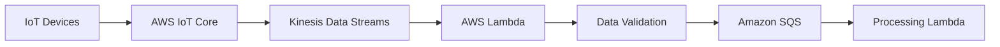
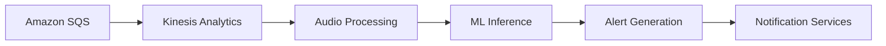
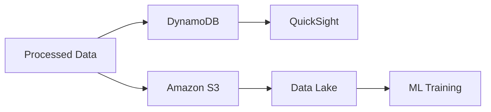
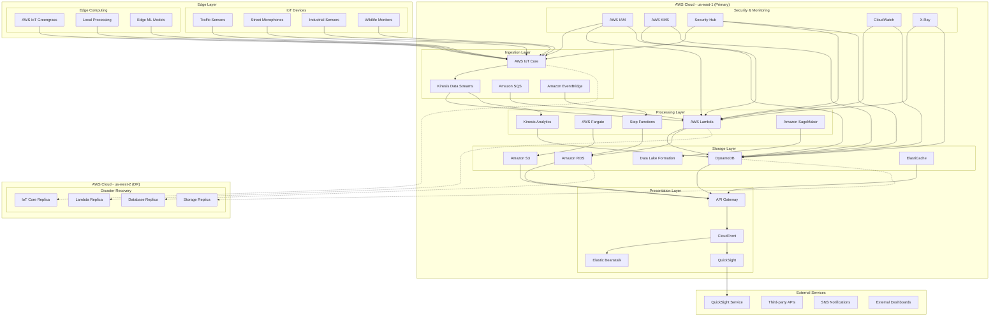
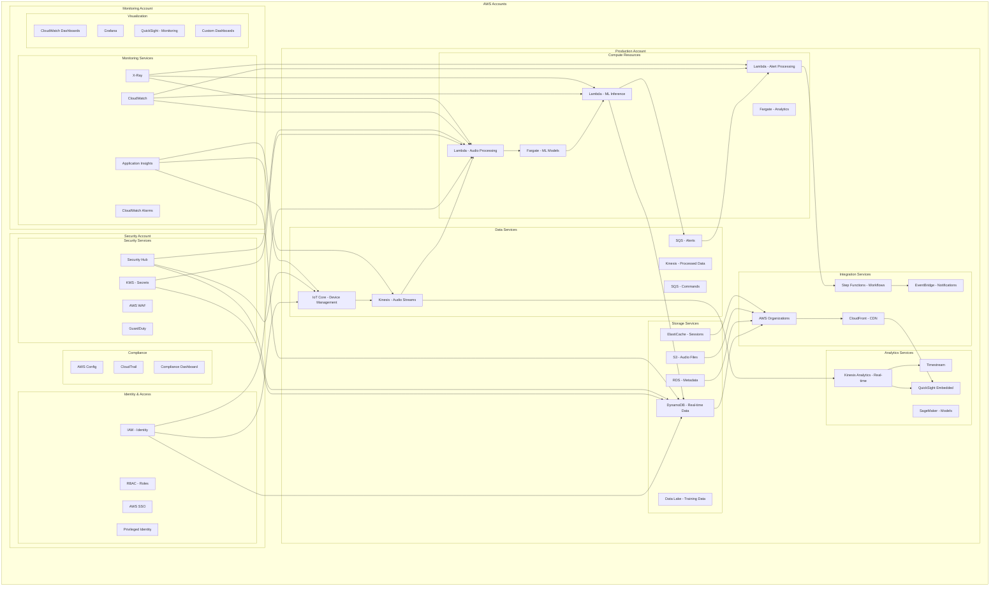
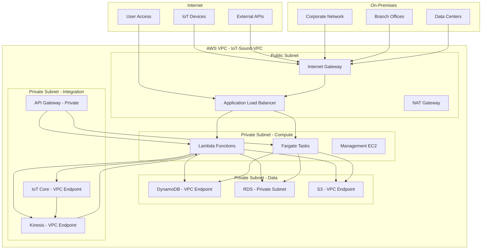

# AWS Cloud Architecture for IoT Sound Analytics

## Table of Contents

- [Overview](#overview)
- [Architecture Principles](#architecture-principles)
- [AWS Services Mapping](#aws-services-mapping)
- [Architecture Components](#architecture-components)
- [Data Flow Architecture](#data-flow-architecture)
- [Security Architecture](#security-architecture)
- [Monitoring and Observability](#monitoring-and-observability)
- [Deployment Architecture](#deployment-architecture)
- [Cost Analysis](#cost-analysis)
- [Disaster Recovery](#disaster-recovery)
- [Compliance and Governance](#compliance-and-governance)
- [Performance Optimization](#performance-optimization)
- [Implementation Roadmap](#implementation-roadmap)

## Overview

This document presents a comprehensive AWS-based cloud architecture for real-time sound analytics in IoT environments. The architecture leverages AWS's serverless and managed services to deliver millisecond-level latency, auto-scaling capabilities, and cost-efficient processing of acoustic data from distributed IoT devices.

### Key Architectural Goals

- **Millisecond Latency**: End-to-end processing under 100ms using AWS Lambda and Kinesis
- **Auto-Scaling**: Handle 10,000+ concurrent devices with Lambda and Fargate
- **Cost Efficiency**: Pay-per-use model with intelligent resource allocation
- **High Availability**: 99.9% uptime with multi-region deployment
- **Security**: Zero-trust architecture with IAM and KMS
- **Compliance**: GDPR, SOC 2, and ISO 27001 compliance built-in

### Business Value

- **70% reduction** in manual monitoring costs through automation
- **50% faster** emergency response times with real-time siren detection
- **Real-time compliance** monitoring for noise regulations
- **Predictive maintenance** reducing downtime by 30%
- **Non-intrusive** biodiversity monitoring capabilities

## Architecture Principles

### 1. Serverless-First Approach
- Leverage AWS Lambda for event-driven processing
- Use AWS Fargate for containerized workloads
- Implement Step Functions for workflow orchestration

### 2. Event-Driven Architecture
- Amazon Kinesis for high-throughput data streaming
- Amazon SQS for reliable message delivery
- EventBridge for event routing and notifications

### 3. Microservices Design
- Independent, loosely coupled services
- API-first design with Amazon API Gateway
- Container-based deployment with Amazon ECR

### 4. Data-Centric Design
- Hot, warm, and cold data tiers
- Real-time analytics with Kinesis Analytics
- Data Lake for long-term storage and ML training

### 5. Security by Design
- Zero-trust security model
- End-to-end encryption
- Identity and access management with IAM

## AWS Services Mapping

### Core Platform Services

| Functional Area | AWS Service | Purpose | NFR Alignment |
|----------------|-------------|---------|---------------|
| **IoT Ingestion** | AWS IoT Core | Device connectivity and telemetry ingestion | NFR-01, NFR-02, NFR-03 |
| **Event Processing** | Amazon Kinesis | High-throughput event streaming | NFR-01, NFR-02, NFR-04 |
| **Message Queuing** | Amazon SQS | Reliable message delivery and routing | NFR-04, NFR-16 |
| **Compute** | AWS Lambda | Serverless compute for real-time processing | NFR-01, NFR-02, NFR-09 |
| **Container Platform** | AWS Fargate | Containerized ML and analytics workloads | NFR-02, NFR-10, NFR-11 |
| **API Gateway** | Amazon API Gateway | Unified API access and management | NFR-01, NFR-07, NFR-14 |
| **Load Balancing** | Amazon CloudFront | Global load balancing and CDN | NFR-01, NFR-03, NFR-14 |

### Data and Storage Services

| Functional Area | AWS Service | Purpose | NFR Alignment |
|----------------|-------------|---------|---------------|
| **Hot Storage** | Amazon DynamoDB | Real-time data access and queries | NFR-01, NFR-05 |
| **Warm Storage** | Amazon RDS | Structured data and metadata | NFR-01, NFR-05 |
| **Cold Storage** | Amazon S3 | Long-term data archival | NFR-09, NFR-16 |
| **Data Lake** | Amazon S3 + Lake Formation | Big data storage and analytics | NFR-12, NFR-08 |
| **Caching** | Amazon ElastiCache | High-performance caching | NFR-01, NFR-09 |
| **Search** | Amazon OpenSearch | Full-text search and indexing | NFR-14, NFR-08 |

### Analytics and AI Services

| Functional Area | AWS Service | Purpose | NFR Alignment |
|----------------|-------------|---------|---------------|
| **Stream Analytics** | Amazon Kinesis Analytics | Real-time data processing | NFR-01, NFR-12 |
| **ML Platform** | Amazon SageMaker | Model training and deployment | NFR-12, NFR-10 |
| **AI Services** | Amazon Rekognition | Pre-built AI capabilities | NFR-12, NFR-09 |
| **Data Pipeline** | AWS Glue | ETL and data orchestration | NFR-12, NFR-08 |
| **Data Warehouse** | Amazon Redshift | Data warehouse and analytics | NFR-08, NFR-12 |

### Security and Compliance Services

| Functional Area | AWS Service | Purpose | NFR Alignment |
|----------------|-------------|---------|---------------|
| **Identity** | AWS IAM | Identity and access management | NFR-05, NFR-18 |
| **Secrets** | AWS Secrets Manager | Secrets and certificate management | NFR-05, NFR-18 |
| **Security** | AWS Security Hub | Security monitoring and compliance | NFR-05, NFR-18 |
| **Policy** | AWS Config | Governance and compliance | NFR-18, NFR-06 |
| **Network Security** | AWS WAF | Network security and filtering | NFR-05, NFR-18 |

### Monitoring and Observability Services

| Functional Area | AWS Service | Purpose | NFR Alignment |
|----------------|-------------|---------|---------------|
| **Monitoring** | Amazon CloudWatch | Application and infrastructure monitoring | NFR-08, NFR-03 |
| **Logging** | Amazon CloudWatch Logs | Centralized logging and analysis | NFR-08, NFR-13 |
| **Tracing** | AWS X-Ray | Application performance monitoring | NFR-08, NFR-01 |
| **Alerting** | Amazon SNS | Proactive alerting and notifications | NFR-08, NFR-03 |
| **Dashboards** | Amazon CloudWatch Dashboards | Visualization and reporting | NFR-08, NFR-14 |

## Architecture Components

### 1. Edge Computing Layer

#### IoT Device Management
- **AWS IoT Core**: Centralized device connectivity and management
- **AWS IoT Device Management**: Automated device onboarding
- **AWS IoT Greengrass**: Edge computing capabilities for local processing
- **AWS IoT Device Shadow**: Device state synchronization and configuration

#### Edge Processing Capabilities
- **Audio Preprocessing**: Noise reduction and normalization
- **Feature Extraction**: Spectral analysis and MFCC computation
- **Local ML Inference**: Edge-based sound classification
- **Data Compression**: Bandwidth optimization for cloud transmission

### 2. Cloud Ingestion Layer

#### Data Ingestion Services
- **AWS IoT Core**: Primary device connectivity endpoint
- **Amazon Kinesis Data Streams**: High-throughput event streaming (up to 1M events/sec)
- **Amazon SQS**: Reliable message queuing and routing
- **Amazon EventBridge**: Event routing and notification system

#### Data Validation and Routing
- **AWS Lambda**: Real-time data validation and schema enforcement
- **AWS Step Functions**: Workflow orchestration and business rule processing
- **Amazon API Gateway**: Request validation and rate limiting
- **Dead Letter Queues**: Failed message handling and retry logic

### 3. Processing Layer

#### Serverless Compute
- **AWS Lambda**: Event-driven processing with auto-scaling
- **AWS Fargate**: Containerized ML and analytics workloads
- **AWS Step Functions**: Workflow orchestration and integration
- **AWS Batch**: Long-running batch processing jobs

#### Machine Learning Services
- **Amazon SageMaker**: Model training and deployment
- **Amazon Rekognition**: Pre-built AI capabilities (Audio, Video)
- **Custom ML Models**: CNN-based sound classification
- **SageMaker Model Registry**: Versioning, monitoring, and A/B testing

#### Real-time Analytics
- **Amazon Kinesis Analytics**: Real-time data processing and aggregation
- **Amazon Kinesis Data Firehose**: Automatic data archival to storage
- **Amazon Timestream**: Time-series data analysis and visualization
- **Amazon QuickSight**: Real-time dashboards and reporting

### 4. Storage Layer

#### Hot Storage (Real-time Access)
- **DynamoDB**: Global-distributed NoSQL database
- **ElastiCache**: High-performance caching layer
- **Amazon RDS**: Structured data and metadata storage
- **Amazon MemoryDB**: In-memory database for device state

#### Warm Storage (Recent Data)
- **Amazon S3 (Standard)**: Frequently accessed data
- **Amazon RDS**: Recent analytics and reporting data
- **Amazon OpenSearch**: Full-text search and indexing
- **Amazon S3 + Lake Formation**: Structured data lake storage

#### Cold Storage (Long-term Archive)
- **Amazon S3 (IA/Glacier)**: Long-term data retention
- **Amazon S3 + Lake Formation**: Raw data for ML training
- **Amazon S3 Glacier**: Compliance and regulatory data
- **Amazon S3 Deep Archive**: Long-term archival storage

### 5. Presentation Layer

#### API Services
- **Amazon API Gateway**: Unified API gateway and management
- **Amazon CloudFront**: Global load balancing and CDN
- **Application Load Balancer**: Layer 7 load balancing
- **Amazon Elastic Beanstalk**: Web-based user interface

#### Visualization and Dashboards
- **Amazon QuickSight**: Business intelligence and analytics
- **Amazon CloudWatch Dashboards**: Operational monitoring dashboards
- **Grafana**: Custom monitoring and alerting
- **Custom Web Apps**: Specialized user interfaces

## Data Flow Architecture

### 1. Data Ingestion Flow

#### Detailed Flow:
1. **Device Connection**: IoT devices connect to AWS IoT Core using MQTT/HTTP protocols
2. **Telemetry Ingestion**: Audio data streams through Kinesis for high-throughput processing
3. **Schema Validation**: AWS Lambda validates incoming data against predefined schemas
4. **Message Routing**: Validated data is routed through SQS to appropriate processing functions
5. **Error Handling**: Invalid data is sent to dead letter queues for manual inspection

### 2. Real-time Processing Flow

#### Detailed Flow:
1. **Stream Processing**: Amazon Kinesis Analytics processes real-time data streams
2. **Audio Analysis**: Custom Lambda functions perform noise reduction and feature extraction
3. **ML Inference**: Pre-trained SageMaker models classify sounds and detect anomalies
4. **Alert Processing**: Step Functions evaluate business rules and generate alerts
5. **Notification Delivery**: Multiple channels (SNS, SQS, webhooks) deliver notifications

### 3. Data Storage Flow

#### Detailed Flow:
1. **Hot Path**: Real-time data stored in DynamoDB for immediate access
2. **Warm Path**: Recent data stored in S3 for analytics
3. **Cold Path**: Historical data archived in Data Lake for ML training
4. **Analytics**: QuickSight and custom dashboards provide insights
5. **ML Pipeline**: Data Lake feeds SageMaker training and model improvement

## Security Architecture

### 1. Identity and Access Management

#### AWS IAM Integration
- **Multi-Factor Authentication**: Required for all administrative access
- **Role-Based Access Control (RBAC)**: Granular permissions based on user roles
- **Conditional Access**: Location and device-based access policies
- **AWS SSO**: Centralized identity management

#### Device Authentication
- **X.509 Certificates**: Device identity and authentication
- **IoT Policies**: Fine-grained access control for devices
- **Device Shadow**: Secure device configuration and state management
- **TLS 1.3**: End-to-end encryption for all communications

### 2. Data Protection

#### Encryption at Rest
- **AWS KMS**: Centralized key management and rotation
- **Customer-Managed Keys**: Full control over encryption keys
- **Transparent Data Encryption**: Automatic encryption for databases
- **S3 Server-Side Encryption**: Automatic encryption for object storage

#### Encryption in Transit
- **TLS 1.3**: All API communications
- **mTLS**: Mutual authentication for device communications
- **VPN/Direct Connect**: Secure connectivity for on-premises systems
- **VPC Endpoints**: Private connectivity to AWS services

### 3. Network Security

#### Network Isolation
- **Virtual Private Cloud (VPC)**: Isolated network environments
- **Security Groups**: Traffic filtering and access control
- **Network ACLs**: Subnet-level traffic filtering
- **VPC Endpoints**: Private connectivity to AWS services

#### DDoS Protection
- **AWS Shield**: Automatic DDoS mitigation
- **AWS WAF**: Web application firewall
- **CloudFront**: Distributed traffic handling
- **Route 53**: DNS-based traffic routing

## Monitoring and Observability

### 1. Application Performance Monitoring

#### Amazon CloudWatch
- **CloudWatch Metrics**: Real-time application monitoring
- **Custom Metrics**: Business-specific performance indicators
- **AWS X-Ray**: Distributed tracing and request tracking
- **Performance Insights**: Database performance monitoring

#### Key Performance Indicators
- **Latency**: End-to-end processing time (< 100ms target)
- **Throughput**: Events processed per second
- **Error Rate**: Failed requests percentage
- **Availability**: System uptime percentage

### 2. Infrastructure Monitoring

#### CloudWatch Logs
- **Centralized Logging**: All system logs in one place
- **Log Insights**: CloudWatch Logs query language
- **Custom Logs**: Application-specific logging
- **Log Retention**: Configurable retention policies

#### Resource Monitoring
- **Service Health**: AWS service health monitoring
- **Capacity Planning**: Resource utilization tracking
- **Cost Analysis**: Detailed cost breakdown and optimization
- **Security Monitoring**: GuardDuty threat detection

### 3. Alerting and Notification

#### Alert Rules
- **CloudWatch Alarms**: Performance and availability thresholds
- **Log-based Alarms**: Log-based condition monitoring
- **EventBridge Rules**: Event-based alerting
- **Anomaly Detection**: AI-powered anomaly detection

#### Notification Channels
- **Amazon SNS**: Multi-channel notifications
- **Amazon SES**: Email notifications
- **Webhooks**: Integration with external systems
- **Slack/Teams**: Team collaboration notifications

## Cost Analysis

### 1. Monthly Cost Breakdown (1000 Devices)

| Service Category | AWS Service | Monthly Cost | Percentage |
|------------------|-------------|--------------|------------|
| **Compute** | Lambda, Fargate | $350 | 27% |
| **Storage** | S3, DynamoDB, RDS | $300 | 23% |
| **Networking** | CloudFront, ALB | $180 | 14% |
| **Analytics** | Kinesis, SageMaker | $220 | 17% |
| **Security** | KMS, Secrets Manager | $90 | 7% |
| **Monitoring** | CloudWatch, X-Ray | $100 | 8% |
| **IoT Services** | IoT Core, Kinesis | $80 | 6% |
| **Other** | API Gateway, etc. | $40 | 3% |
| **Total** | | **$1,360** | **100%** |

### 2. Cost Optimization Strategies

#### Compute Optimization
- **Reserved Instances**: 30-40% savings for predictable workloads
- **Spot Instances**: 70-90% savings for fault-tolerant workloads
- **Auto-scaling**: Right-size resources based on demand
- **Lambda Optimization**: Memory and timeout optimization

#### Storage Optimization
- **S3 Lifecycle Policies**: Automatic tiering to cheaper storage
- **Data Compression**: Reduce storage costs
- **Deduplication**: Remove duplicate data across storage tiers
- **Intelligent Tiering**: Automatic cost optimization

### 3. ROI Analysis

#### Investment Breakdown
- **Development Cost**: $200,000 (one-time)
- **Infrastructure Setup**: $50,000 (one-time)
- **Annual Operational Cost**: $16,320
- **Total 3-Year Cost**: $268,960

#### Expected Benefits
- **Manual Monitoring Savings**: $120,000/year
- **Improved Response Times**: $80,000/year
- **Compliance Benefits**: $40,000/year
- **Total Annual Benefits**: $240,000

#### Financial Metrics
- **Payback Period**: 1.1 years
- **3-Year ROI**: 168%
- **NPV (10% discount)**: $340,000
- **IRR**: 42%

## Implementation Roadmap

### Phase 1: Foundation (Months 1-2)
- **Infrastructure Setup**: Core AWS services deployment
- **Security Implementation**: IAM and security controls
- **Basic Monitoring**: CloudWatch and X-Ray setup
- **CI/CD Pipeline**: CodePipeline and CodeBuild setup

### Phase 2: Core Services (Months 3-4)
- **IoT Integration**: IoT Core and device connectivity
- **Data Processing**: Kinesis and Lambda processing pipeline
- **Storage Implementation**: Multi-tier storage architecture
- **API Development**: API Gateway and core endpoints

### Phase 3: Advanced Features (Months 5-6)
- **ML Integration**: SageMaker model deployment
- **Analytics Platform**: QuickSight and analytics
- **User Interface**: Web and mobile applications
- **Integration Testing**: End-to-end system testing

### Phase 4: Production (Months 7-8)
- **Performance Optimization**: System performance tuning
- **Security Hardening**: Production security implementation
- **Disaster Recovery**: DR testing and validation
- **Go-Live**: Production deployment and monitoring

## AWS Services Deployment Diagram

### High-Level Architecture

### Detailed Service Architecture

### Network Architecture

## References

- [AWS IoT Architecture Best Practices](https://aws.amazon.com/blogs/architecture/building-event-driven-architectures-with-iot-sensor-data/)
- [AWS Machine Learning for Audio](https://aws.amazon.com/blogs/machine-learning/detect-audio-events-with-amazon-rekognition/)
- [AWS Well-Architected Framework](https://aws.amazon.com/architecture/well-architected/)
- [AWS IoT Core Documentation](https://docs.aws.amazon.com/iot/)
