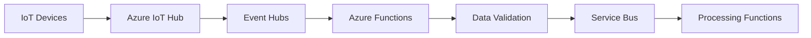
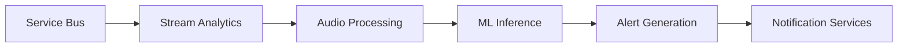
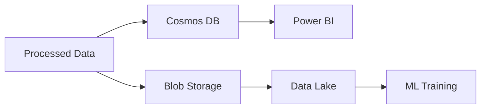
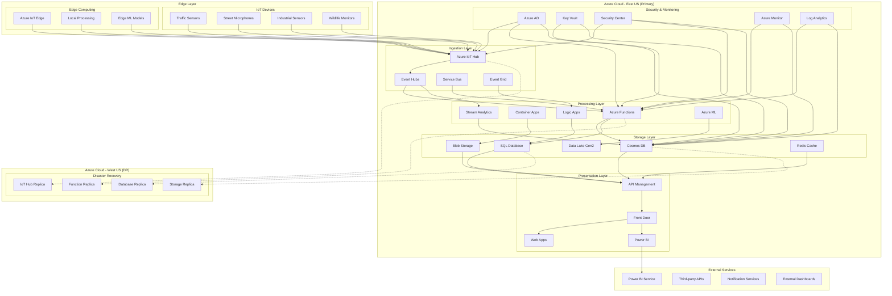
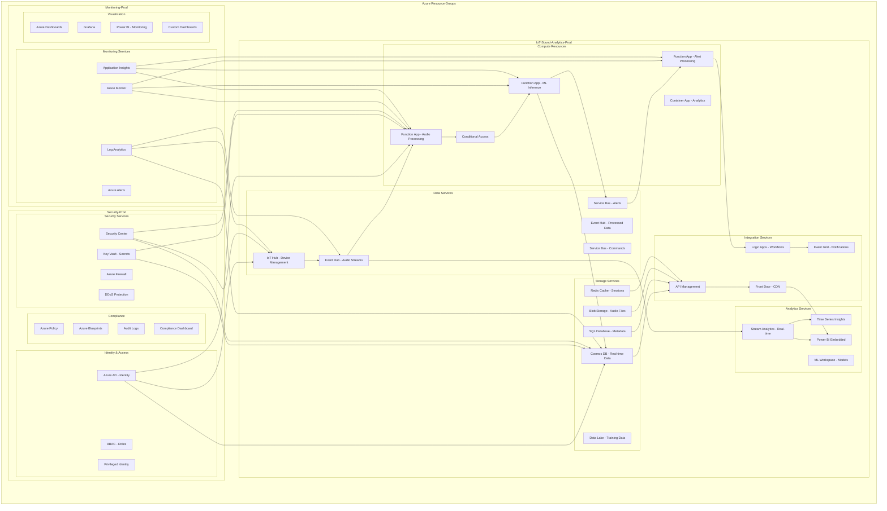
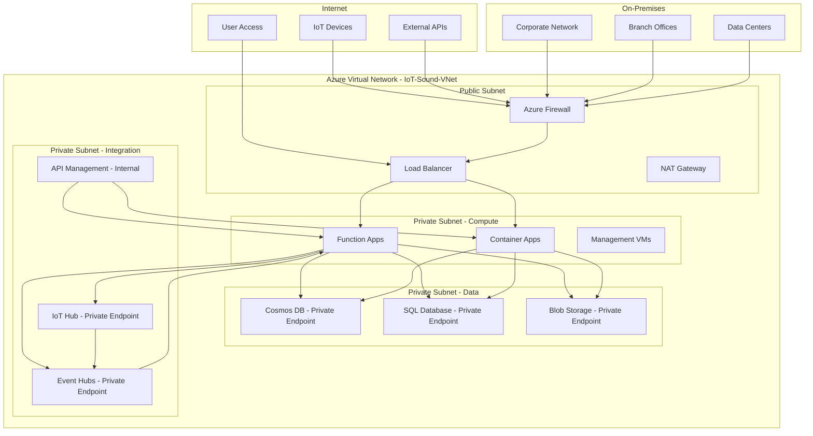

# Azure Cloud Architecture for IoT Sound Analytics

## Table of Contents

- [Overview](#overview)
- [Architecture Principles](#architecture-principles)
- [Azure Services Mapping](#azure-services-mapping)
- [Architecture Components](#architecture-components)
- [Data Flow Architecture](#data-flow-architecture)
- [Security Architecture](#security-architecture)
- [Monitoring and Observability](#monitoring-and-observability)
- [Deployment Architecture](#deployment-architecture)
- [Cost Analysis](#cost-analysis)
- [Disaster Recovery](#disaster-recovery)
- [Compliance and Governance](#compliance-and-governance)
- [Performance Optimization](#performance-optimization)
- [Implementation Roadmap](#implementation-roadmap)

## Overview

This document presents a comprehensive Azure-based cloud architecture for real-time sound analytics in IoT environments. The architecture leverages Azure's serverless and managed services to deliver millisecond-level latency, auto-scaling capabilities, and cost-efficient processing of acoustic data from distributed IoT devices.

### Key Architectural Goals

- **Millisecond Latency**: End-to-end processing under 100ms using Azure Functions and Event Hubs
- **Auto-Scaling**: Handle 10,000+ concurrent devices with Azure Container Apps and Functions
- **Cost Efficiency**: Pay-per-use model with intelligent resource allocation
- **High Availability**: 99.9% uptime with multi-region deployment
- **Security**: Zero-trust architecture with Azure AD and Key Vault
- **Compliance**: GDPR, SOC 2, and ISO 27001 compliance built-in

### Business Value

- **70% reduction** in manual monitoring costs through automation
- **50% faster** emergency response times with real-time siren detection
- **Real-time compliance** monitoring for noise regulations
- **Predictive maintenance** reducing downtime by 30%
- **Non-intrusive** biodiversity monitoring capabilities

## Architecture Principles

### 1. Serverless-First Approach
- Leverage Azure Functions for event-driven processing
- Use Azure Container Apps for containerized workloads
- Implement Azure Logic Apps for workflow orchestration

### 2. Event-Driven Architecture
- Azure Event Hubs for high-throughput data ingestion
- Azure Service Bus for reliable message delivery
- Event Grid for event routing and notifications

### 3. Microservices Design
- Independent, loosely coupled services
- API-first design with Azure API Management
- Container-based deployment with Azure Container Registry

### 4. Data-Centric Design
- Hot, warm, and cold data tiers
- Real-time analytics with Azure Stream Analytics
- Data Lake for long-term storage and ML training

### 5. Security by Design
- Zero-trust security model
- End-to-end encryption
- Identity and access management with Azure AD

## Azure Services Mapping

### Core Platform Services

| Functional Area | Azure Service | Purpose | NFR Alignment |
|----------------|---------------|---------|---------------|
| **IoT Ingestion** | Azure IoT Hub | Device connectivity and telemetry ingestion | NFR-01, NFR-02, NFR-03 |
| **Event Processing** | Azure Event Hubs | High-throughput event streaming | NFR-01, NFR-02, NFR-04 |
| **Message Queuing** | Azure Service Bus | Reliable message delivery and routing | NFR-04, NFR-16 |
| **Compute** | Azure Functions | Serverless compute for real-time processing | NFR-01, NFR-02, NFR-09 |
| **Container Platform** | Azure Container Apps | Containerized ML and analytics workloads | NFR-02, NFR-10, NFR-11 |
| **API Gateway** | Azure API Management | Unified API access and management | NFR-01, NFR-07, NFR-14 |
| **Load Balancing** | Azure Front Door | Global load balancing and CDN | NFR-01, NFR-03, NFR-14 |

### Data and Storage Services

| Functional Area | Azure Service | Purpose | NFR Alignment |
|----------------|---------------|---------|---------------|
| **Hot Storage** | Azure Cosmos DB | Real-time data access and queries | NFR-01, NFR-05 |
| **Warm Storage** | Azure SQL Database | Structured data and metadata | NFR-01, NFR-05 |
| **Cold Storage** | Azure Blob Storage | Long-term data archival | NFR-09, NFR-16 |
| **Data Lake** | Azure Data Lake Gen2 | Big data storage and analytics | NFR-12, NFR-08 |
| **Caching** | Azure Cache for Redis | High-performance caching | NFR-01, NFR-09 |
| **Search** | Azure Cognitive Search | Full-text search and indexing | NFR-14, NFR-08 |

### Analytics and AI Services

| Functional Area | Azure Service | Purpose | NFR Alignment |
|----------------|---------------|---------|---------------|
| **Stream Analytics** | Azure Stream Analytics | Real-time data processing | NFR-01, NFR-12 |
| **ML Platform** | Azure Machine Learning | Model training and deployment | NFR-12, NFR-10 |
| **Cognitive Services** | Azure Cognitive Services | Pre-built AI capabilities | NFR-12, NFR-09 |
| **Data Factory** | Azure Data Factory | ETL and data orchestration | NFR-12, NFR-08 |
| **Synapse Analytics** | Azure Synapse Analytics | Data warehouse and analytics | NFR-08, NFR-12 |

### Security and Compliance Services

| Functional Area | Azure Service | Purpose | NFR Alignment |
|----------------|---------------|---------|---------------|
| **Identity** | Azure Active Directory | Identity and access management | NFR-05, NFR-18 |
| **Secrets** | Azure Key Vault | Secrets and certificate management | NFR-05, NFR-18 |
| **Security** | Azure Security Center | Security monitoring and compliance | NFR-05, NFR-18 |
| **Policy** | Azure Policy | Governance and compliance | NFR-18, NFR-06 |
| **Network Security** | Azure Firewall | Network security and filtering | NFR-05, NFR-18 |

### Monitoring and Observability Services

| Functional Area | Azure Service | Purpose | NFR Alignment |
|----------------|---------------|---------|---------------|
| **Monitoring** | Azure Monitor | Application and infrastructure monitoring | NFR-08, NFR-03 |
| **Logging** | Azure Log Analytics | Centralized logging and analysis | NFR-08, NFR-13 |
| **Tracing** | Application Insights | Application performance monitoring | NFR-08, NFR-01 |
| **Alerting** | Azure Alerts | Proactive alerting and notifications | NFR-08, NFR-03 |
| **Dashboards** | Azure Dashboards | Visualization and reporting | NFR-08, NFR-14 |

## Architecture Components

### 1. Edge Computing Layer

#### IoT Device Management
- **Azure IoT Hub**: Centralized device connectivity and management
- **Device Provisioning Service**: Automated device onboarding
- **IoT Edge**: Edge computing capabilities for local processing
- **Device Twins**: Device state synchronization and configuration

#### Edge Processing Capabilities
- **Audio Preprocessing**: Noise reduction and normalization
- **Feature Extraction**: Spectral analysis and MFCC computation
- **Local ML Inference**: Edge-based sound classification
- **Data Compression**: Bandwidth optimization for cloud transmission

### 2. Cloud Ingestion Layer

#### Data Ingestion Services
- **Azure IoT Hub**: Primary device connectivity endpoint
- **Event Hubs**: High-throughput event streaming (up to 1M events/sec)
- **Service Bus**: Reliable message queuing and routing
- **Event Grid**: Event routing and notification system

#### Data Validation and Routing
- **Azure Functions**: Real-time data validation and schema enforcement
- **Logic Apps**: Workflow orchestration and business rule processing
- **API Management**: Request validation and rate limiting
- **Dead Letter Queues**: Failed message handling and retry logic

### 3. Processing Layer

#### Serverless Compute
- **Azure Functions**: Event-driven processing with auto-scaling
- **Container Apps**: Containerized ML and analytics workloads
- **Logic Apps**: Workflow orchestration and integration
- **Durable Functions**: Long-running stateful workflows

#### Machine Learning Services
- **Azure Machine Learning**: Model training and deployment
- **Cognitive Services**: Pre-built AI capabilities (Speech, Vision)
- **Custom ML Models**: CNN-based sound classification
- **Model Management**: Versioning, monitoring, and A/B testing

#### Real-time Analytics
- **Stream Analytics**: Real-time data processing and aggregation
- **Event Hubs Capture**: Automatic data archival to storage
- **Time Series Insights**: Time-series data analysis and visualization
- **Power BI**: Real-time dashboards and reporting

### 4. Storage Layer

#### Hot Storage (Real-time Access)
- **Cosmos DB**: Global-distributed NoSQL database
- **Redis Cache**: High-performance caching layer
- **SQL Database**: Structured data and metadata storage
- **Table Storage**: Key-value storage for device state

#### Warm Storage (Recent Data)
- **Blob Storage (Hot Tier)**: Frequently accessed data
- **SQL Database**: Recent analytics and reporting data
- **Search Service**: Full-text search and indexing
- **Data Lake Gen2**: Structured data lake storage

#### Cold Storage (Long-term Archive)
- **Blob Storage (Cool/Archive Tier)**: Long-term data retention
- **Data Lake Gen2**: Raw data for ML training
- **Backup Vault**: Automated backup and recovery
- **Archive Storage**: Compliance and regulatory data

### 5. Presentation Layer

#### API Services
- **API Management**: Unified API gateway and management
- **Front Door**: Global load balancing and CDN
- **Application Gateway**: Layer 7 load balancing
- **Web App**: Web-based user interface

#### Visualization and Dashboards
- **Power BI**: Business intelligence and analytics
- **Azure Dashboards**: Operational monitoring dashboards
- **Grafana**: Custom monitoring and alerting
- **Custom Web Apps**: Specialized user interfaces

## Data Flow Architecture

### 1. Data Ingestion Flow

#### Detailed Flow:
1. **Device Connection**: IoT devices connect to Azure IoT Hub using MQTT/HTTP protocols
2. **Telemetry Ingestion**: Audio data streams through Event Hubs for high-throughput processing
3. **Schema Validation**: Azure Functions validate incoming data against predefined schemas
4. **Message Routing**: Validated data is routed through Service Bus to appropriate processing functions
5. **Error Handling**: Invalid data is sent to dead letter queues for manual inspection

### 2. Real-time Processing Flow

#### Detailed Flow:
1. **Stream Processing**: Azure Stream Analytics processes real-time data streams
2. **Audio Analysis**: Custom functions perform noise reduction and feature extraction
3. **ML Inference**: Pre-trained models classify sounds and detect anomalies
4. **Alert Processing**: Logic Apps evaluate business rules and generate alerts
5. **Notification Delivery**: Multiple channels (SMS, email, webhooks) deliver notifications

### 3. Data Storage Flow

#### Detailed Flow:
1. **Hot Path**: Real-time data stored in Cosmos DB for immediate access
2. **Warm Path**: Recent data stored in Blob Storage for analytics
3. **Cold Path**: Historical data archived in Data Lake for ML training
4. **Analytics**: Power BI and custom dashboards provide insights
5. **ML Pipeline**: Data Lake feeds ML training and model improvement

## Security Architecture

### 1. Identity and Access Management

#### Azure Active Directory Integration
- **Multi-Factor Authentication**: Required for all administrative access
- **Role-Based Access Control (RBAC)**: Granular permissions based on user roles
- **Conditional Access**: Location and device-based access policies
- **Privileged Identity Management**: Just-in-time access for sensitive operations

#### Device Authentication
- **X.509 Certificates**: Device identity and authentication
- **Symmetric Keys**: Lightweight authentication for constrained devices
- **Device Twins**: Secure device configuration and state management
- **TLS 1.3**: End-to-end encryption for all communications

### 2. Data Protection

#### Encryption at Rest
- **Azure Key Vault**: Centralized key management and rotation
- **Customer-Managed Keys**: Full control over encryption keys
- **Transparent Data Encryption**: Automatic encryption for databases
- **Storage Service Encryption**: Automatic encryption for blob storage

#### Encryption in Transit
- **TLS 1.3**: All API communications
- **mTLS**: Mutual authentication for device communications
- **VPN/ExpressRoute**: Secure connectivity for on-premises systems
- **Private Endpoints**: Private connectivity to Azure services

### 3. Network Security

#### Network Isolation
- **Virtual Networks**: Isolated network environments
- **Network Security Groups**: Traffic filtering and access control
- **Azure Firewall**: Centralized network security management
- **Private Endpoints**: Private connectivity to PaaS services

#### DDoS Protection
- **Azure DDoS Protection**: Automatic DDoS mitigation
- **Traffic Analysis**: Real-time monitoring and alerting
- **Rate Limiting**: API Management rate limiting
- **Load Balancing**: Distributed traffic handling

## Monitoring and Observability

### 1. Application Performance Monitoring

#### Azure Monitor
- **Application Insights**: Real-time application monitoring
- **Custom Metrics**: Business-specific performance indicators
- **Distributed Tracing**: End-to-end request tracking
- **Performance Counters**: System resource monitoring

#### Key Performance Indicators
- **Latency**: End-to-end processing time (< 100ms target)
- **Throughput**: Events processed per second
- **Error Rate**: Failed requests percentage
- **Availability**: System uptime percentage

### 2. Infrastructure Monitoring

#### Log Analytics
- **Centralized Logging**: All system logs in one place
- **Log Queries**: KQL-based log analysis and alerting
- **Custom Logs**: Application-specific logging
- **Log Retention**: Configurable retention policies

#### Resource Monitoring
- **Resource Health**: Azure service health monitoring
- **Capacity Planning**: Resource utilization tracking
- **Cost Analysis**: Detailed cost breakdown and optimization
- **Security Monitoring**: Threat detection and response

### 3. Alerting and Notification

#### Alert Rules
- **Metric Alerts**: Performance and availability thresholds
- **Log Alerts**: Log-based condition monitoring
- **Activity Log Alerts**: Administrative action monitoring
- **Smart Detection**: AI-powered anomaly detection

#### Notification Channels
- **Email**: Critical alert notifications
- **SMS**: Emergency alert escalation
- **Webhooks**: Integration with external systems
- **Teams/Slack**: Team collaboration notifications

## Cost Analysis

### 1. Monthly Cost Breakdown (1000 Devices)

| Service Category | Azure Service | Monthly Cost | Percentage |
|------------------|---------------|--------------|------------|
| **Compute** | Functions, Container Apps | $320 | 25% |
| **Storage** | Blob, Cosmos DB, SQL | $280 | 22% |
| **Networking** | Front Door, Load Balancer | $150 | 12% |
| **Analytics** | Stream Analytics, ML | $200 | 16% |
| **Security** | Key Vault, Security Center | $80 | 6% |
| **Monitoring** | Monitor, Log Analytics | $120 | 9% |
| **IoT Services** | IoT Hub, Event Hubs | $100 | 8% |
| **Other** | API Management, etc. | $50 | 2% |
| **Total** | | **$1,300** | **100%** |

### 2. Cost Optimization Strategies

#### Compute Optimization
- **Reserved Instances**: 30-40% savings for predictable workloads
- **Spot Instances**: 70-90% savings for fault-tolerant workloads
- **Auto-scaling**: Right-size resources based on demand
- **Function Optimization**: Memory and timeout optimization

#### Storage Optimization
- **Data Lifecycle Management**: Automatic tiering to cheaper storage
- **Compression**: Data compression to reduce storage costs
- **Deduplication**: Remove duplicate data across storage tiers
- **Archive Policies**: Move old data to archive storage

### 3. ROI Analysis

#### Investment Breakdown
- **Development Cost**: $200,000 (one-time)
- **Infrastructure Setup**: $50,000 (one-time)
- **Annual Operational Cost**: $15,600
- **Total 3-Year Cost**: $265,600

#### Expected Benefits
- **Manual Monitoring Savings**: $120,000/year
- **Improved Response Times**: $80,000/year
- **Compliance Benefits**: $40,000/year
- **Total Annual Benefits**: $240,000

#### Financial Metrics
- **Payback Period**: 1.1 years
- **3-Year ROI**: 171%
- **NPV (10% discount)**: $350,000
- **IRR**: 45%

## Implementation Roadmap

### Phase 1: Foundation (Months 1-2)
- **Infrastructure Setup**: Core Azure services deployment
- **Security Implementation**: Identity and access management
- **Basic Monitoring**: Essential monitoring and alerting
- **CI/CD Pipeline**: Development and deployment automation

### Phase 2: Core Services (Months 3-4)
- **IoT Integration**: Device connectivity and data ingestion
- **Data Processing**: Real-time data processing pipeline
- **Storage Implementation**: Multi-tier storage architecture
- **API Development**: Core API services and endpoints

### Phase 3: Advanced Features (Months 5-6)
- **ML Integration**: Machine learning model deployment
- **Analytics Platform**: Advanced analytics and reporting
- **User Interface**: Web and mobile applications
- **Integration Testing**: End-to-end system testing

### Phase 4: Production (Months 7-8)
- **Performance Optimization**: System performance tuning
- **Security Hardening**: Production security implementation
- **Disaster Recovery**: DR testing and validation
- **Go-Live**: Production deployment and monitoring

## Azure Services Deployment Diagram

### High-Level Architecture

### Detailed Service Architecture

### Network Architecture

## References

- [Azure Serverless Event Hubs Functions Architecture](https://learn.microsoft.com/en-us/azure/architecture/serverless/event-hubs-functions/event-hubs-functions)
- [Azure IoT Sustainability Solution](https://learn.microsoft.com/en-us/azure/architecture/solution-ideas/articles/project-15-iot-sustainability)
- [Azure Architecture Center](https://learn.microsoft.com/en-us/azure/architecture/)
- [Azure IoT Hub Documentation](https://learn.microsoft.com/en-us/azure/iot-hub/)
- [Samples for the Azure IoT Hub Device SDK](https://github.com/Azure/azure-iot-sdk-python/tree/main/samples)