# Architecture Diagram

```mermaid
graph TB
    subgraph "Edge Computing Zone"
        subgraph "Urban Environment"
            U1[Traffic Sensors]
            U2[Street Microphones]
            U3[Intersection Cameras]
        end
        
        subgraph "Industrial Facilities"
            I1[Machinery Sensors]
            I2[Factory Microphones]
            I3[Equipment Monitors]
        end
        
        subgraph "Natural Habitats"
            N1[Wildlife Microphones]
            N2[Environmental Sensors]
            N3[Weather Stations]
        end
        
        subgraph "Edge Processing"
            EP1[Local Audio Processing]
            EP2[Data Compression]
            EP3[Edge ML Inference]
        end
    end
    
    subgraph "Cloud Ingestion Zone"
        subgraph "AWS"
            AWS_IOT[AWS IoT Hub]
            AWS_KINESIS[Kinesis Data Streams]
            AWS_SQS[SQS Queues]
        end
        
        subgraph "Azure"
            AZ_IOT[Azure IoT Hub]
            AZ_EVENT[Event Hubs]
            AZ_QUEUE[Service Bus]
        end
        
        subgraph "Google Cloud"
            GCP_IOT[Cloud IoT Core]
            GCP_PUBSUB[Pub/Sub]
            GCP_FUNCTIONS[Cloud Functions]
        end
        
        subgraph "Message Processing"
            MP1[Schema Validation]
            MP2[Data Routing]
            MP3[Backpressure Handling]
        end
    end
    
    subgraph "Serverless Processing Zone"
        subgraph "Audio Processing"
            AP1[Noise Reduction]
            AP2[Feature Extraction]
            AP3[Spectral Analysis]
        end
        
        subgraph "ML Inference"
            ML1[CNN Models]
            ML2[Sound Classification]
            ML3[Confidence Scoring]
        end
        
        subgraph "Alert Processing"
            AL1[Rule Engine]
            AL2[Notification Service]
            AL3[Escalation Manager]
        end
        
        subgraph "FaaS Platforms"
            LAMBDA[AWS Lambda]
            AZ_FUNC[Azure Functions]
            GCP_FUNC[Google Cloud Functions]
        end
    end
    
    subgraph "Storage and Analytics Zone"
        subgraph "Hot Storage"
            HS1[DynamoDB]
            HS2[Cosmos DB]
            HS3[Firestore]
        end
        
        subgraph "Cold Storage"
            CS1[S3]
            CS2[Blob Storage]
            CS3[Cloud Storage]
        end
        
        subgraph "Data Lakes"
            DL1[Data Lake Formation]
            DL2[Synapse Analytics]
            DL3[BigQuery]
        end
        
        subgraph "Analytics"
            AN1[Time Series Analysis]
            AN2[Spatial Processing]
            AN3[ML Training Pipeline]
        end
    end
    
    subgraph "Presentation and Monitoring Zone"
        subgraph "APIs"
            API1[REST APIs]
            API2[GraphQL]
            API3[WebSocket]
        end
        
        subgraph "Dashboards"
            DASH1[Grafana]
            DASH2[Power BI]
            DASH3[Data Studio]
        end
        
        subgraph "Monitoring"
            MON1[CloudWatch]
            MON2[Application Insights]
            MON3[Cloud Monitoring]
        end
        
        subgraph "External Access"
            EXT1[Web Portal]
            EXT2[Mobile App]
            EXT3[API Clients]
        end
    end
    
    subgraph "Cross-Cloud Services"
        subgraph "Security"
            SEC1[Identity Management]
            SEC2[Encryption Services]
            SEC3[Compliance Tools]
        end
        
        subgraph "Networking"
            NET1[VPN Connections]
            NET2[Load Balancers]
            NET3[CDN Services]
        end
        
        subgraph "DevOps"
            DEV1[CI/CD Pipelines]
            DEV2[Infrastructure as Code]
            DEV3[Container Orchestration]
        end
    end
    
    %% Edge to Cloud connections
    U1 --> AWS_IOT
    U2 --> AZ_IOT
    U3 --> GCP_IOT
    I1 --> AWS_IOT
    I2 --> AZ_IOT
    I3 --> GCP_IOT
    N1 --> AWS_IOT
    N2 --> AZ_IOT
    N3 --> GCP_IOT
    
    EP1 --> AWS_IOT
    EP2 --> AZ_IOT
    EP3 --> GCP_IOT
    
    %% Cloud ingestion connections
    AWS_IOT --> AWS_KINESIS
    AZ_IOT --> AZ_EVENT
    GCP_IOT --> GCP_PUBSUB
    
    AWS_KINESIS --> MP1
    AZ_EVENT --> MP1
    GCP_PUBSUB --> MP1
    
    %% Processing connections
    MP1 --> AP1
    AP1 --> ML1
    ML1 --> AL1
    
    AP1 --> LAMBDA
    AP2 --> AZ_FUNC
    AP3 --> GCP_FUNC
    
    ML1 --> LAMBDA
    ML2 --> AZ_FUNC
    ML3 --> GCP_FUNC
    
    %% Storage connections
    AL1 --> HS1
    AL2 --> HS2
    AL3 --> HS3
    
    HS1 --> CS1
    HS2 --> CS2
    HS3 --> CS3
    
    CS1 --> DL1
    CS2 --> DL2
    CS3 --> DL3
    
    %% Analytics connections
    DL1 --> AN1
    DL2 --> AN2
    DL3 --> AN3
    
    %% Presentation connections
    HS1 --> API1
    HS2 --> API2
    HS3 --> API3
    
    API1 --> DASH1
    API2 --> DASH2
    API3 --> DASH3
    
    DASH1 --> EXT1
    DASH2 --> EXT2
    DASH3 --> EXT3
    
    %% Monitoring connections
    LAMBDA --> MON1
    AZ_FUNC --> MON2
    GCP_FUNC --> MON3
    
    %% Cross-cloud connections
    SEC1 --> AWS_IOT
    SEC1 --> AZ_IOT
    SEC1 --> GCP_IOT
    
    NET1 --> AWS_IOT
    NET1 --> AZ_IOT
    NET1 --> GCP_IOT
    
    DEV1 --> LAMBDA
    DEV1 --> AZ_FUNC
    DEV1 --> GCP_FUNC
```

## Architecture Zones Description

### Edge Computing Zone
- **Urban Environment**: Traffic sensors, street microphones, intersection cameras
- **Industrial Facilities**: Machinery sensors, factory microphones, equipment monitors
- **Natural Habitats**: Wildlife microphones, environmental sensors, weather stations
- **Edge Processing**: Local audio processing, data compression, edge ML inference

### Cloud Ingestion Zone
- **Multi-Cloud IoT Hubs**: AWS IoT Hub, Azure IoT Hub, Google Cloud IoT Core
- **Message Streaming**: Kinesis, Event Hubs, Pub/Sub for real-time data processing
- **Message Processing**: Schema validation, data routing, backpressure handling

### Serverless Processing Zone
- **Audio Processing**: Noise reduction, feature extraction, spectral analysis
- **ML Inference**: CNN models, sound classification, confidence scoring
- **Alert Processing**: Rule engine, notification service, escalation manager
- **FaaS Platforms**: AWS Lambda, Azure Functions, Google Cloud Functions

### Storage and Analytics Zone
- **Hot Storage**: DynamoDB, Cosmos DB, Firestore for real-time access
- **Cold Storage**: S3, Blob Storage, Cloud Storage for long-term archival
- **Data Lakes**: Data Lake Formation, Synapse Analytics, BigQuery
- **Analytics**: Time series analysis, spatial processing, ML training pipeline

### Presentation and Monitoring Zone
- **APIs**: REST APIs, GraphQL, WebSocket for data access
- **Dashboards**: Grafana, Power BI, Data Studio for visualization
- **Monitoring**: CloudWatch, Application Insights, Cloud Monitoring
- **External Access**: Web portal, mobile app, API clients

### Cross-Cloud Services
- **Security**: Identity management, encryption services, compliance tools
- **Networking**: VPN connections, load balancers, CDN services
- **DevOps**: CI/CD pipelines, Infrastructure as Code, container orchestration
