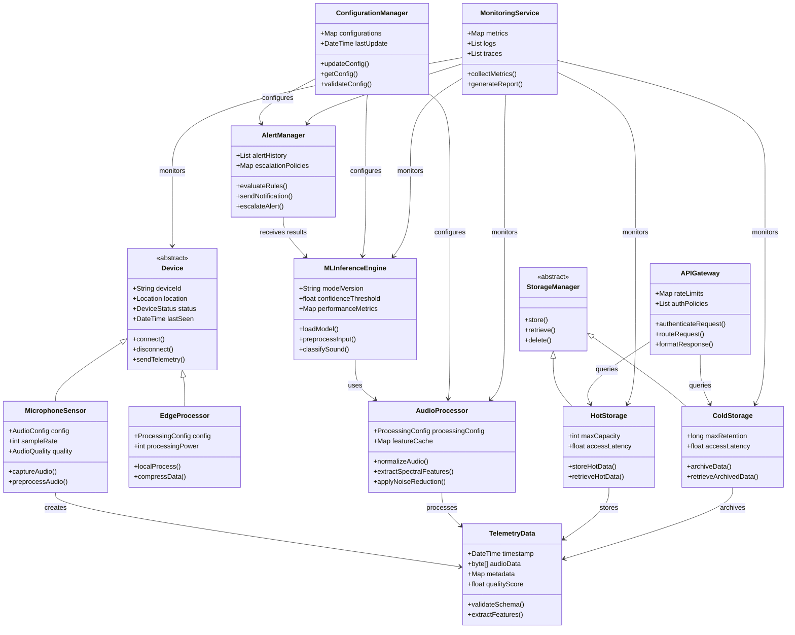

# UML Class Diagram

## Class Descriptions

### Device Hierarchy
- **Device**: Abstract base class for all IoT sensors with common attributes and methods
- **MicrophoneSensor**: Concrete implementation for audio capture with audio-specific configuration
- **EdgeProcessor**: Concrete implementation for local preprocessing with processing power management

### Data Classes
- **TelemetryData**: Encapsulates audio payload information with validation and feature extraction capabilities

### Processing Classes
- **AudioProcessor**: Handles real-time audio analysis with caching and configuration management
- **MLInferenceEngine**: Manages machine learning operations with performance tracking and model versioning
- **AlertManager**: Processes classification results with escalation policies and notification management

### Storage Classes
- **StorageManager**: Abstract interface for data persistence operations
- **HotStorage**: High-performance storage for real-time data access
- **ColdStorage**: Long-term archival storage with retention management

### Infrastructure Classes
- **APIGateway**: Manages external communications with authentication and rate limiting
- **ConfigurationManager**: Handles dynamic configuration updates across all components
- **MonitoringService**: Aggregates observability data from all system components

## Key Relationships
- **Inheritance**: Device hierarchy and StorageManager hierarchy
- **Composition**: Components use and manage data objects
- **Dependencies**: Processing pipeline dependencies and monitoring relationships
