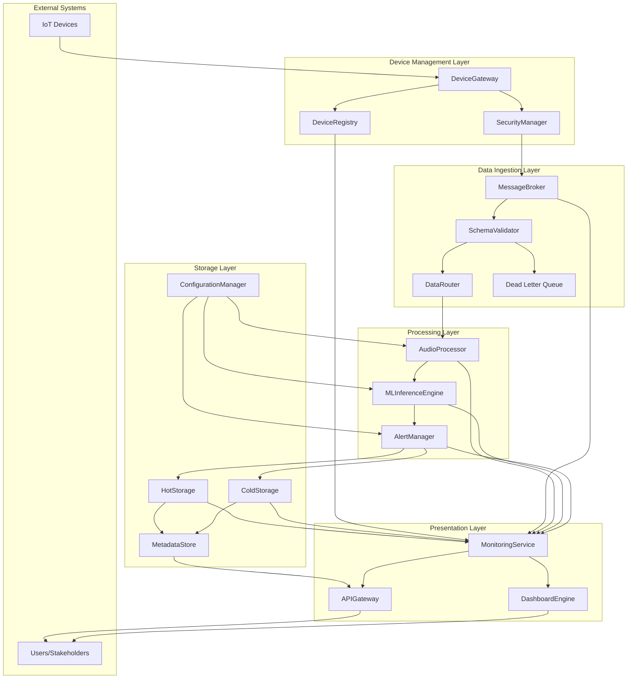

# Component View Diagram

## Component Descriptions

### Device Management Layer
- **DeviceRegistry**: Handles IoT device onboarding, authentication, and lifecycle management
- **SecurityManager**: Enforces mTLS protocols and manages cryptographic keys
- **DeviceGateway**: Primary entry point for telemetry data from sensors and microphones

### Data Ingestion Layer
- **MessageBroker**: Implements event-driven message queuing with backpressure handling
- **SchemaValidator**: Performs real-time payload validation against predefined schemas
- **DataRouter**: Intelligently distributes validated audio streams to processing pipelines
- **Dead Letter Queue**: Handles invalid or corrupted data for manual inspection

### Processing Layer
- **AudioProcessor**: Handles real-time audio preprocessing and feature extraction
- **MLInferenceEngine**: Executes pretrained CNN models for sound classification
- **AlertManager**: Processes classification results and triggers notifications

### Storage Layer
- **HotStorage**: Real-time data access for immediate querying
- **ColdStorage**: Long-term archival for compliance and historical analysis
- **MetadataStore**: Maintains indexes and searchable metadata
- **ConfigurationManager**: Handles dynamic configuration updates

### Presentation Layer
- **APIGateway**: Provides unified RESTful APIs with authentication
- **DashboardEngine**: Generates interactive visualizations and monitoring interfaces
- **MonitoringService**: Aggregates metrics, logs, and traces from all components
