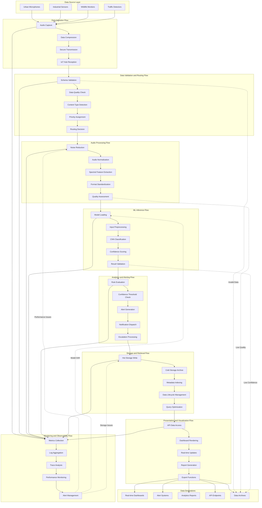

# Data Flow Diagram

## Data Flow Stages Description

### 1. Data Source Layer
- **Urban Microphones**: Capture traffic noise, sirens, urban soundscapes
- **Industrial Sensors**: Monitor machinery sounds, equipment health
- **Wildlife Monitors**: Record environmental sounds, species detection
- **Traffic Detectors**: Collect acoustic traffic data, congestion indicators

### 2. Data Ingestion Flow
- **Audio Capture**: Real-time audio recording at various sampling rates
- **Data Compression**: Optimize bandwidth usage while maintaining quality
- **Secure Transmission**: Encrypted data transmission via MQTT/HTTP
- **IoT Hub Reception**: Centralized data collection and initial processing

### 3. Data Validation and Routing Flow
- **Schema Validation**: Ensure data format compliance and integrity
- **Data Quality Check**: Verify audio quality and completeness
- **Content Type Detection**: Identify audio source and characteristics
- **Priority Assignment**: Determine processing priority based on content
- **Routing Decision**: Direct data to appropriate processing pipelines

### 4. Audio Processing Flow
- **Noise Reduction**: Remove background noise and interference
- **Audio Normalization**: Standardize audio levels and characteristics
- **Spectral Feature Extraction**: Extract frequency domain features using librosa
- **Format Standardization**: Convert to consistent audio formats
- **Quality Assessment**: Evaluate processed audio quality

### 5. ML Inference Flow
- **Model Loading**: Load appropriate pretrained CNN models
- **Input Preprocessing**: Prepare audio features for model input
- **CNN Classification**: Execute sound classification algorithms
- **Confidence Scoring**: Calculate classification confidence levels
- **Result Validation**: Verify classification results and quality

### 6. Analytics and Alerting Flow
- **Rule Evaluation**: Apply business rules and thresholds
- **Confidence Threshold Check**: Validate classification confidence
- **Alert Generation**: Create alerts for significant events
- **Notification Dispatch**: Send alerts via multiple channels
- **Escalation Processing**: Handle alert escalation and follow-up

### 7. Storage and Retrieval Flow
- **Hot Storage Write**: Store recent data for immediate access
- **Cold Storage Archive**: Archive older data for long-term retention
- **Metadata Indexing**: Create searchable metadata indexes
- **Data Lifecycle Management**: Apply retention and archival policies
- **Query Optimization**: Optimize data retrieval performance

### 8. Presentation and Visualization Flow
- **API Data Access**: Provide programmatic data access
- **Dashboard Rendering**: Generate real-time visualizations
- **Real-time Updates**: Stream live data to dashboards
- **Report Generation**: Create scheduled and ad-hoc reports
- **Export Functions**: Enable data export in various formats

### 9. Monitoring and Observability Flow
- **Metrics Collection**: Gather performance and usage metrics
- **Log Aggregation**: Centralize system logs and events
- **Trace Analysis**: Track request flows and performance
- **Performance Monitoring**: Monitor system health and performance
- **Alert Management**: Manage system alerts and notifications

## Key Features
- **Error Handling**: Invalid or low-quality data is routed to archives
- **Feedback Loops**: Monitoring data influences processing parameters
- **Multi-Destination**: Data flows to multiple output destinations
- **Quality Gates**: Quality checks at each processing stage
- **Real-time Processing**: Continuous data flow with minimal latency
