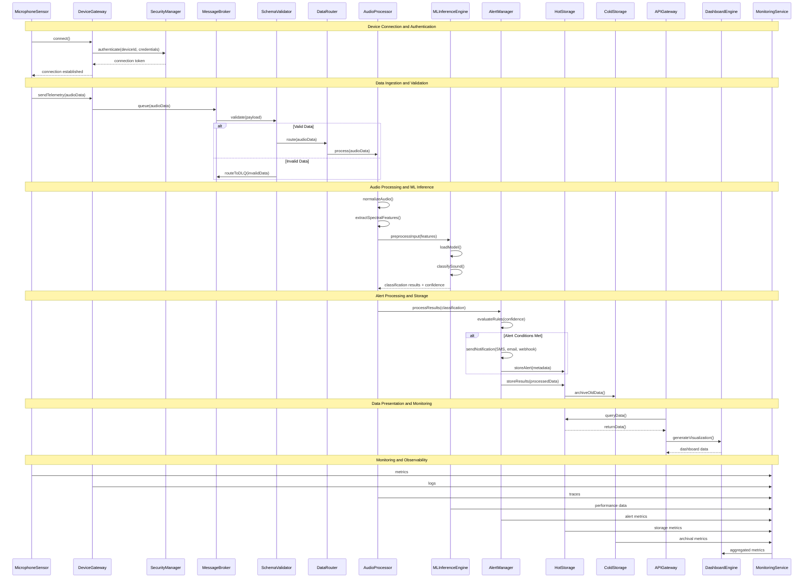

# UML Sequence Diagram

## Sequence Flow Description

### 1. Device Connection and Authentication
- MicrophoneSensor initiates connection to DeviceGateway
- SecurityManager authenticates device using mTLS protocols
- Connection token is returned for secure communication

### 2. Data Ingestion and Validation
- Audio data is sent from sensor to DeviceGateway
- MessageBroker queues the data with backpressure handling
- SchemaValidator performs real-time payload validation
- Valid data is routed to processing pipeline, invalid data goes to DLQ

### 3. Audio Processing and ML Inference
- AudioProcessor normalizes and extracts spectral features
- MLInferenceEngine loads pretrained CNN model
- Sound classification is performed with confidence scoring
- Results are returned for further processing

### 4. Alert Processing and Storage
- AlertManager evaluates business rules and confidence thresholds
- Notifications are sent through multiple channels if conditions are met
- Data is stored in both hot and cold storage systems
- Data lifecycle management is applied

### 5. Data Presentation and Monitoring
- APIGateway queries data from storage systems
- DashboardEngine generates real-time visualizations
- MonitoringService aggregates metrics from all components
- Comprehensive observability is maintained throughout the flow
