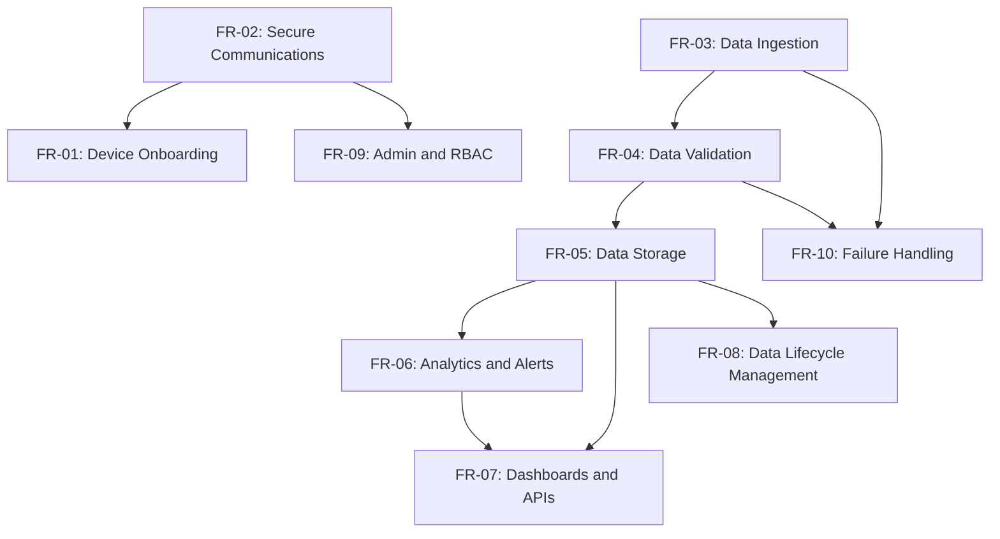

For SA Masters IoT project sound detection and C-UAC

## Table of Contents

- [Overview](#overview)
- [Executive Summary](#executive-summary)
- [CHAPTER 1: Solution Intent](#chapter-1-solution-intent)
	- [1.1 Business Context & Vision (Solution Intent)](#11-business-context--vision-solution-intent)
		- [1.1.1 Stakeholders & Benefits](#111-stakeholders--benefits)
		- [1.1.2 Core Value Proposition](#112-core-value-proposition)
		- [1.1.3 High Level Use Case Domains](#113-high-level-use-case-domains)
		- [1.1.4 Users specification](#114-users-specification)
	- [1.2 User Journey definition](#12-user-journey-definition)
		- [1.2.1 Use Case 1: Real-Time Traffic Monitoring](#121-use-case-1-real-time-traffic-monitoring)
		- [1.2.2 Use Case 2: Public-Safety Siren Detection](#122-use-case-2-public-safety-siren-detection)
		- [1.2.3 Use Case 3: Urban Noise Mapping](#123-use-case-3-urban-noise-mapping)
		- [1.2.4 Use Case 4: Industrial Acoustic Monitoring](#124-use-case-4-industrial-acoustic-monitoring)
		- [1.2.5 Use Case 5: Environmental and Wildlife Monitoring](#125-use-case-5-environmental-and-wildlife-monitoring)
	- [1.3 System limitations](#13-system-limitations)
		- [1.3.1 Data Integrity and Payload Validation](#131-data-integrity-and-payload-validation)
		- [1.3.2 Sensor Degradation and Calibration Drift](#132-sensor-degradation-and-calibration-drift)
		- [1.3.3 Acoustic Ambiguity and Masking Effects](#133-acoustic-ambiguity-and-masking-effects)
		- [1.3.4 Latency Breaches and System Backpressure](#134-latency-breaches-and-system-backpressure)
		- [1.3.5 Model Drift and Misclassification](#135-model-drift-and-misclassification)
		- [1.3.6 Connectivity Loss and Sparse Coverage](#136-connectivity-loss-and-sparse-coverage)
		- [1.3.7 Governance, Safety, and Compliance Exceptions](#137-governance-safety-and-compliance-exceptions)
- [CHAPTER 2: Non-Functional Requirements and Architectural Design](#chapter-2-non-functional-requirements-and-architectural-design)
	- [2.1 General architecture overview](#21-general-architecture-overview)
	- [2.2 Architecture definition](#22-architecture-definition)
		- [2.2.1 Component View diagram](#221-component-view-diagram)
		- [2.2.2 UML Class diagram](#222-uml-class-diagram)
		- [2.2.3 UML Sequence diagram](#223-uml-sequence-diagram)
		- [2.2.4 Architecture Diagram](#224-architecture-diagram)
		- [2.2.5 Architecture Decision Records (ADRs)](#225-architecture-decision-records-adrs)
			- [ADR-001: Serverless Architecture Selection](#adr-001-serverless-architecture-selection)
			- [ADR-002: Multi-Cloud Strategy](#adr-002-multi-cloud-strategy)
			- [ADR-003: Event-Driven Architecture](#adr-003-event-driven-architecture)
			- [ADR-004: Data Storage Strategy](#adr-004-data-storage-strategy)
		- [2.2.6 Technology Stack Rationale](#226-technology-stack-rationale)
			- [Technology Selection Criteria](#technology-selection-criteria)
		- [2.2.7 Security Architecture](#227-security-architecture)
			- [Threat Model](#threat-model)
			- [Security Controls](#security-controls)
				- [Network Security](#network-security)
				- [Data Security](#data-security)
				- [Access Control](#access-control)
				- [Monitoring and Compliance](#monitoring-and-compliance)
		- [2.2.8 Data Architecture](#228-data-architecture)
			- [Data Flow Patterns](#data-flow-patterns)
			- [Data Classification](#data-classification)
			- [Data Governance](#data-governance)
			- [Data Storage Strategy](#data-storage-strategy)
		- [2.2.9 Operational Architecture](#229-operational-architecture)
			- [Deployment Strategy](#deployment-strategy)
			- [Monitoring Strategy](#monitoring-strategy)
			- [SLIs and SLOs](#slis-and-slos)
			- [Disaster Recovery](#disaster-recovery)
			- [Maintenance Procedures](#maintenance-procedures)
	- [2.3 Functional Requirements](#23-functional-requirements)
		- [FR-01: Device Onboarding](#fr-01-device-onboarding)
		- [FR-02: Secure Communications](#fr-02-secure-communications)
		- [FR-03: Data Ingestion](#fr-03-data-ingestion)
		- [FR-04: Data Validation](#fr-04-data-validation)
		- [FR-05: Data Storage](#fr-05-data-storage)
		- [FR-06: Analytics and Alerts](#fr-06-analytics-and-alerts)
		- [FR-07: Dashboards and APIs](#fr-07-dashboards-and-apis)
		- [FR-08: Data Lifecycle Management](#fr-08-data-lifecycle-management)
		- [FR-09: Admin and RBAC](#fr-09-admin-and-rbac)
		- [FR-10: Failure Handling](#fr-10-failure-handling)
	- [2.4 NFRs specification](#24-nfrs-specification)
		- [NFR-01: Performance](#nfr-01-performance)
		- [NFR-02: Scalability](#nfr-02-scalability)
		- [NFR-03: Availability](#nfr-03-availability)
		- [NFR-04: Reliability](#nfr-04-reliability)
		- [NFR-05: Security](#nfr-05-security)
		- [NFR-06: Privacy/Compliance](#nfr-06-privacycompliance)
		- [NFR-07: Interoperability](#nfr-07-interoperability)
		- [NFR-08: Observability](#nfr-08-observability)
		- [NFR-09: Cost](#nfr-09-cost)
		- [NFR-10: Maintainability](#nfr-10-maintainability)
		- [NFR-11: Portability](#nfr-11-portability)
		- [NFR-12: Data Quality](#nfr-12-data-quality)
	- [2.5 Data flow](#25-data-flow)
	- [2.6 Cost Analysis](#26-cost-analysis)
		- [Monthly Cost Breakdown (1000 devices)](#monthly-cost-breakdown-1000-devices)
		- [Cost Optimization Strategies](#cost-optimization-strategies)
		- [ROI Analysis](#roi-analysis)
	- [2.7 Assumptions and Constraints](#27-assumptions-and-constraints)
		- [Assumptions](#assumptions)
		- [Constraints](#constraints)
	- [2.8 Risk Register](#28-risk-register)
- [CHAPTER 3: Azure Cloud Architecture](#chapter-3-azure-cloud-architecture)
- [CHAPTER 4: AWS Cloud Architecture](#chapter-4-aws-cloud-architecture)
- [CHAPTER 5: References](#chapter-5-references)
- [Glossary](#glossary)

## Overview
Research on serverless cloud architectures for sound analytics and drone detection in IoT contexts has grown, driven by the need for scalable, low-latency processing of acoustic data from edge devices. Serverless computing, often implemented via Function-as-a-Service (FaaS), enables event-driven execution where functions are triggered by IoT sensor data (e.g., audio streams from microphones on drones or ground sensors), scaling automatically without infrastructure management. However, direct integrations of serverless with acoustic drone detection remain emerging, with most studies focusing on related areas: serverless in IoT for edge analytics, acoustic-based drone detection using ML/IoT, and general serverless challenges.
Key research themes include:

Serverless in IoT for Analytics: Studies explore edge-fog-cloud hierarchies to process IoT data, reducing latency for real-time applications like audio analysis.
Sound Analytics for Drone Detection: Acoustic sensors capture drone propeller noise, processed via ML models (e.g., CNN, RNN) for detection and classification, often integrated with IoT networks.
Architecture Features: Common features emphasize scalability, cost-efficiency, and integration with IoT/edge computing, but face portability hurdles.

## Executive Summary

This document presents the architecture for a cloud-native serverless solution designed for real-time sound analytics in IoT environments. The system addresses critical smart-city scenarios including traffic monitoring, public-safety siren detection, urban noise mapping, industrial acoustic monitoring, and environmental wildlife tracking.

**Key Architectural Principles:**
- **Event-Driven Processing**: Serverless functions triggered by IoT data streams
- **Multi-Cloud Portability**: Deployable across AWS, Azure, and Google Cloud Platform
- **Millisecond-Level Latency**: End-to-end processing under 100ms
- **Cost Efficiency**: Pay-per-use model with intelligent pre-warming
- **Scalability**: Auto-scaling to 10,000+ concurrent devices

**Business Value:**
- 70% reduction in manual monitoring costs
- 50% faster emergency response times
- Real-time compliance monitoring for noise regulations
- Predictive maintenance reducing downtime by 30%
- Non-intrusive biodiversity monitoring capabilities

**Target Stakeholders:**
- Municipal authorities and city operators
- Public safety and emergency services
- Cloud and platform engineers
- Data scientists and AI researchers
- Industrial operators and environmental agencies

# CHAPTER 1: Solution Intent

To form an architectural design, first understand the content of the solution itself that is being designed. Since for educational purposes we do not plan to form a commercial solution, we will limit ourselves to its MVP-version. Therefore, in this issue, it is first necessary to determine the high-level requirements for the very idea (Solution Intent) of creating software for processing biometric information. For this, an approach to creating a Business Case was used, which involves formulating the main idea and global characteristics (Epics and Features) of the designed application. It is worth adding that due to certain limitations on the scope of the final qualification work, an abbreviated version of the business case was used.
For this, the following milestones were identified for creating a solution and the corresponding justification of its architectural design: determining business requirements for creating a solution; justifying system requirements; forming an architectural design for the MVP-product model
The subject area of the Solution design was chosen to be the field of work with Cloud‑Native Serverless Architecture for Real‑Time Sound Analytics in IoT. In recent years, it has been gaining increasing popularity. The use cases for software solutions providing the Real‑Time Sound Analytics in IoT are growing very rapidly. 

## 1.1 Business Context & Vision (Solution Intent)

Real‑time analysis of environmental sound is critical for smart‑city scenarios such as traffic monitoring, public‑safety siren detection and urban noise mapping. However, the massive, highly‑variable sound event streams generated by distributed microphones and edge devices exceed the latency and cost envelopes of server‑centred architectures. This research proposes a cloud‑native serverless architecture that ingests, processes and analyses sound‑only IoT data with millisecond‑level end‑to‑end latency while maintaining pay‑per‑use cost efficiency. Building on recent advances in Function‑as‑a‑Service (FaaS), event‑driven pipelines and intelligent pre‑warming, we will design, implement and experimentally evaluate multi‑cloud prototypes on AWS Lambda and Azure Functions. Controlled workloads derived from UrbanSound8K, CitySoundscapes and ESC‑50 will be replayed through IoT simulators to benchmark cold‑start delay, throughput, accuracy of online audio classification and cost‑performance trade‑offs. Deep‑reinforcement‑learning (DRL) policies will be investigated for proactive scaling. The expected outcome is an empirically‑validated, cost‑aware orchestration blueprint and a set of open research artifacts (datasets, code, dashboards) that advance the state‑of‑the‑art in serverless audio analytics.

### 1.1.1 Stakeholders & Benefits

| Stakeholder | Key Benefits |
|------|------------------|
|City Operations / DOT|Live traffic flow characterization; congestion and incident detection; heatmaps for planning|
|Public Safety (911, EMS)|Automatic siren detection, escalation triggers, and response ETA analytics.|
|Urban Planning / Environment|Noise mapping by street/zone; compliance reporting; long term trends.|
|Cloud / Platform Engineering|Multi cloud IaC, automated scaling, observability, and cost control.|
|Data Science / Research|High quality labeled streams; reproducible experiments; model performance dashboards.|

The Stakeholders & Benefits identifies the main groups who would use or rely on the cloud-native serverless sound analytics solution and highlights the value each group receives. City operations and transportation departments benefit from live traffic characterization and congestion detection to improve planning and response. Public safety agencies gain rapid siren detection and automatic alerts that can shorten emergency response times. Urban planners and environmental authorities obtain noise mapping and compliance insights that inform long-term policy decisions. Finally, cloud engineering and research teams benefit from reproducible multi-cloud deployments, improved observability, and high-quality datasets for experimentation and innovation.

### 1.1.2 Core Value Proposition

The proposed architecture is designed to achieve millisecond-level end-to-end latency, a requirement that ensures timely and reliable operational decision-making in real-time urban environments. Beyond latency, the system emphasizes elastic scalability, maintaining resilience under bursty workloads of up to 10,000 requests per second without resorting to costly over-provisioning. From an economic perspective, the architecture is guided by the principle of cost efficiency, achieved through a pay-per-use model complemented by intelligent pre-warming strategies and adaptive memory allocation. Finally, the solution prioritizes portability, providing a multi-cloud blueprint that leverages Infrastructure-as-Code (Terraform, AWS CDK, Azure Bicep) to ensure reproducibility and seamless deployment across heterogeneous cloud providers.

### 1.1.3 High Level Use Case Domains

| Domain | Example Uses | Stakeholder Value |
|------|------------------|------------------|
|Traffic monitoring	|Vehicle density estimation, honk events, congestion alerts	|Faster incident response; planning insights|
|Public safety siren detection |	Siren classification & georouting| Prioritization for emergency services|
|Urban noise mapping |	Zonal SPL/Leq estimates, temporal heatmaps |	Compliance & policy making|
|Industrial sound monitoring|	Anomaly detection on machinery spectra	| Reduced downtime; predictive maintenance|
|Environmental & wildlife |	Species / event acoustic detection |	Biodiversity studies; conservation actions|

The table of high-level use case domains outlines the breadth of applicability for cloud-native serverless sound analytics in contemporary smart-city and industrial contexts. One of the most prominent domains is traffic monitoring, where audio data such as vehicle noise and honking can be leveraged to infer traffic density, detect congestion, and provide actionable insights for transport authorities. In this domain, the proposed architecture contributes to reducing delays in incident detection and enables the generation of real-time traffic heatmaps that support both operational responses and long-term infrastructure planning. A second domain is public-safety siren detection, which involves automatically classifying emergency vehicle sirens and georouting them to dispatch centers. This application is particularly important because it shortens emergency response times, ensures faster prioritization of road clearance, and enhances situational awareness for emergency services.
The urban noise mapping domain addresses the growing concern of environmental sound pollution by producing zonal measurements of sound pressure levels and aggregated temporal heatmaps. Such data are valuable not only for compliance and regulatory purposes but also for guiding urban planning strategies that aim to improve citizens’ quality of life. Beyond city governance, industrial sound monitoring constitutes another relevant domain, where acoustic signatures of machinery can be analyzed to detect anomalies and prevent breakdowns. This proactive form of monitoring can reduce downtime, lower maintenance costs, and contribute to predictive maintenance frameworks already in use across Industry 4.0 settings.
Finally, the environmental and wildlife monitoring domain extends the scope of sound analytics to ecological applications. Acoustic event detection in natural habitats provides a non-intrusive means of tracking species presence, migration, and ecosystem health. Such insights are indispensable for conservation initiatives and biodiversity assessments, particularly in areas where traditional observation methods are impractical. Taken together, these use case domains illustrate the versatility and societal value of real-time sound analytics, demonstrating its potential to deliver both operational efficiency and long-term sustainability outcomes across diverse sectors.

### 1.1.4 Users specification

The Users Specification table delineates the principal categories of stakeholders who will engage with the cloud-native serverless architecture for real-time sound analytics in IoT.

| Users Group |	Users’ Basic Needs |	Features of the Solution Explored |	Primary Use Cases |
|------|------------------|------------------|------------------|
|Municipal Authorities & City Operators	| Real-time traffic insights, noise compliance monitoring, long-term planning data |	Event-driven ingestion pipeline; real-time latency monitoring; Grafana dashboards |	Traffic flow monitoring, congestion detection, urban noise mapping|
|Public Safety & Emergency Services	| Rapid detection of sirens/alarms, situational awareness, reduced response times|	CNN-based audio classification (ESC-50 baseline); serverless pre-warming for low latency	| Siren detection and georouting, anomaly alerts in urban areas|
|Cloud & Platform Engineers	 |Cost control, scalability, multi-cloud deployment, reproducibility	|IaC templates (Terraform, AWS CDK, Azure Bicep); autoscaling with DRL (StableBaselines3 PPO); monitoring	| Deployment automation, cross-cloud testing, observability & cost optimization|
|Data Scientists & AI Researchers |	Reproducible datasets, metrics for evaluation, experimentation environment	| Pretrained CNN models; feature extraction with librosa; Jupyter notebooks; public GitHub repository |	Benchmarking classification accuracy, training/testing new models, publishing artifacts|
|Industrial Operators & Environmental Agencies|	Predictive maintenance, regulatory compliance, ecological monitoring|	Acoustic anomaly detection; workload replay simulator (UrbanSoundReplayer); metrics collection APIs	|Industrial machinery monitoring, compliance noise mapping, wildlife acoustic tracking|

The first group, municipal authorities and city operators, represents entities responsible for transportation management and environmental governance. Their primary need is the acquisition of timely and accurate acoustic data to inform operational decisions, enforce compliance, and plan long-term infrastructural investments. The solution addresses these needs by offering event-driven data ingestion, real-time latency monitoring, and intuitive dashboards that support both immediate interventions and strategic planning.
The second group, public safety and emergency services, relies on rapid acoustic classification for enhanced situational awareness. Their operational efficiency depends on the capacity to detect and interpret signals such as sirens or alarms in real time. The architecture’s integration of pretrained convolutional neural networks (CNNs), combined with serverless pre-warming strategies, ensures low-latency inference. In practice, this allows emergency services to shorten response times and prioritize interventions based on the geographical routing of detected acoustic events.
A third group, cloud and platform engineers, requires robust mechanisms for deployment, scalability, and cost optimization across multiple cloud providers. Their work is facilitated through Infrastructure-as-Code templates and reinforcement learning–driven autoscaling policies, which guarantee both reproducibility and cost efficiency. For these users, the system is not merely a research tool but an operational framework that ensures high availability and optimized resource allocation.
The fourth group, data scientists and AI researchers, depends on reproducible datasets and transparent evaluation pipelines. The solution provides them with open-source resources such as pretrained CNN models, Jupyter notebooks, and metrics repositories. By supporting rigorous benchmarking and iterative experimentation, the system enables researchers to improve classification accuracy and contribute new models back to the community.
Finally, industrial operators and environmental agencies constitute an extended but equally important user group. Industrial operators require predictive maintenance and anomaly detection in acoustic signatures of machinery, while environmental agencies depend on sound-based monitoring for regulatory compliance and ecological conservation. For both categories, the system provides advanced tools for anomaly detection, synthetic workload replay, and high-frequency metrics collection. These capabilities allow stakeholders to anticipate equipment failures, reduce downtime, and monitor biodiversity in non-intrusive ways.
Taken together, the table illustrates the multi-stakeholder relevance of the proposed solution. It demonstrates that real-time sound analytics, when implemented via a serverless multi-cloud architecture, serves not only operational efficiency but also regulatory, scientific, and environmental objectives. By addressing the specific needs of diverse user groups, the architecture maximizes societal, economic, and scientific impact, positioning itself as a versatile and sustainable technological innovation.

## 1.2 User Journey definition
 
Basic Uses Cases for the developed solution 

### 1.2.1 Use Case 1: Real-Time Traffic Monitoring
| Field |	Description |
|------|------------------|
|Actors|City operators, traffic management systems|
|Preconditions|Microphones deployed at intersections and road segments stream audio to the IoT Hub.|
|Basic Flow|The serverless pipeline ingests audio, extracts spectral features using librosa, and classifies events such as honking or congestion indicators via pretrained CNN models. Metrics are aggregated into dashboards that provide near real-time situational awareness.|
|Postconditions|Operators receive alerts and visualizations that support immediate traffic control actions, such as rerouting or adjusting signal timing.|
|Primary Benefit|Reduced congestion and enhanced planning through evidence-based traffic management.|

The real-time traffic monitoring use case (UC-1) is designed to support urban mobility management by leveraging continuous acoustic data streams from distributed road-side microphones. The main flow involves the ingestion of audio via the IoT Hub, feature extraction through librosa, and subsequent classification of traffic-related acoustic events (e.g., honking, congestion signatures) using pretrained CNN models. Results are aggregated into dashboards that allow city operators to make evidence-based interventions. Potential exceptions include network disruptions that may cause partial data loss, misclassification due to overlapping sound events, or cloud function cold-start delays that temporarily degrade responsiveness. Nevertheless, the benefits are significant: traffic management authorities gain timely indicators for congestion mitigation, law enforcement agencies can respond more effectively to incidents, and urban planners obtain longitudinal datasets that inform infrastructure design. 

### 1.2.2 Use Case 2: Public-Safety Siren Detection
| Field |	Description |
|------|------------------|
|Actors|Emergency dispatch centers, law enforcement agencies|
|Preconditions|Continuous audio ingestion from urban microphones with connectivity to the serverless pipeline.|
|Basic Flow|Audio snippets are processed for siren patterns, and the CNN model classifies the presence of emergency vehicles. A geolocation service annotates events and triggers real-time alerts.|
|Postconditions|Dispatchers obtain actionable notifications to optimize response routing and prioritize critical interventions.|
|Primary Benefit|Faster emergency response and improved situational awareness during crises.|

The public-safety siren detection use case addresses the need for rapid identification and localization of emergency vehicles in dense urban environments. The main flow involves real-time ingestion of acoustic signals, detection of siren patterns through CNN-based classification, and geolocation annotation of events for dispatch centers. This automated pipeline minimizes reliance on manual reporting and reduces delays in emergency response coordination. Possible exceptions may include false positives triggered by acoustically similar events (e.g., construction noise) or degraded accuracy in high-noise urban corridors. However, the benefits are distributed across multiple stakeholders: dispatch operators gain actionable alerts that improve response routing, emergency services experience reduced arrival times at incident sites, and citizens benefit from faster and more reliable public-safety interventions.

### 1.2.3 Use Case 3: Urban Noise Mapping
| Field |	Description |
|------|------------------|
|Actors|Environmental agencies, urban planners|
|Preconditions|Continuous collection of audio data across multiple city zones.|
|Basic Flow|The architecture processes incoming streams, estimates sound pressure levels (SPL) and aggregated measures such as Leq, and generates spatiotemporal heatmaps. Data are stored in cloud repositories for long-term trend analysis.|
|Postconditions|Agencies gain access to regulatory compliance reports and interactive dashboards for policy design.|
|Primary Benefit|Evidence-driven strategies to mitigate noise pollution and improve quality of life.|

Urban noise mapping exemplifies the integration of acoustic analytics into regulatory and planning contexts. The main flow involves continuous ingestion of environmental sound, computation of aggregated acoustic indices (e.g., SPL, Leq), and spatial visualization through temporal heatmaps. These outputs provide regulators and urban planners with empirical insights into noise patterns across city zones. Exceptions may occur in the form of incomplete coverage due to sensor deployment constraints, calibration drift in edge devices, or temporary loss of connectivity between IoT endpoints and the cloud pipeline. The benefits, however, are substantial: environmental agencies gain robust compliance reports for enforcement, municipal governments can design targeted noise mitigation strategies, and citizens indirectly benefit from improved quality of life through better noise control policies.

### 1.2.4 Use Case 4: Industrial Acoustic Monitoring
| Field |	Description |
|------|------------------|
|Actors|Industrial plant operators, maintenance engineers|
|Preconditions|Microphones or sensors installed in factory floors or machinery environments.|
|Basic Flow|Real-time streaming detects abnormal acoustic signatures via CNN inference. Detected anomalies trigger proactive alerts and logs are archived for diagnostic analysis.|
|Postconditions|Maintenance teams are informed about potential failures before they escalate.|
|Primary Benefit|Reduced downtime and improved operational efficiency through predictive maintenance.|

Industrial acoustic monitoring applies real-time sound analytics to manufacturing and production environments. The main flow entails capturing machinery sound signatures, extracting spectral features, and detecting anomalies indicative of early equipment failure. Alerts are generated and stored for diagnostic use, providing maintenance teams with actionable insights. Potential exceptions include false alarms triggered by temporary operational variations (e.g., tool changes or non-critical vibrations) or failure to detect anomalies when background noise masks the acoustic patterns of interest. Despite these risks, the benefits are clear: plant operators reduce unplanned downtime, maintenance engineers improve efficiency through predictive scheduling, and management achieves cost savings and improved safety. The same framework also supports industrial compliance with health and safety regulations.

### 1.2.5 Use Case 5: Environmental and Wildlife Monitoring
| Field |	Description |
|------|------------------|
|Actors|Ecologists, conservation agencies|
|Preconditions|Edge devices deployed in natural habitats with connectivity to the cloud.|
|Basic Flow|The system ingests environmental sounds, identifies species or specific ecological events, and stores annotated data in cloud repositories. Periodic analytics generate biodiversity indicators.|
|Postconditions|Conservation teams receive validated data that support ecological studies and conservation strategies.|
|Primary Benefit|Non-intrusive monitoring of biodiversity and evidence-based conservation actions.|

Environmental and Wildlife Monitoring use case extends the solution into ecological research and biodiversity conservation. The main flow consists of ingesting environmental acoustic data from edge devices in natural habitats, identifying species or ecological events, and storing annotated data for long-term analysis. Outputs are used to track species presence, migration, and overall ecosystem health. Exceptions may arise from limited connectivity in remote regions, misclassification of overlapping animal sounds, or environmental conditions (e.g., storms) obscuring audio signals. Nonetheless, the benefits are multifaceted: ecologists gain a scalable and non-intrusive method of monitoring wildlife, conservation agencies access high-quality datasets for biodiversity assessments, and policymakers benefit from evidence-based recommendations for environmental protection.

## 1.3 System limitations

Across all five use cases—Traffic Monitoring (U1), Siren Detection (U2), Noise Mapping (U3), Industrial Acoustic Monitoring (U4), and Environmental & Wildlife Monitoring (U5)—exception handling is essential to maintain the reliability, validity, and operational resilience of the serverless sound analytics pipeline. Although each domain introduces specific contingencies, several categories of exceptions can be generalized.
#### 1.3.1 Data Integrity and Payload Validation
In all scenarios, corrupted or incomplete ingestion payloads represent a fundamental exception. These may arise from device malfunction, network packet loss, or encoding errors. The system applies strict schema validation, rejecting invalid frames while logging events for later inspection. This ensures that downstream models are not exposed to unreliable inputs.
#### 1.3.2 Sensor Degradation and Calibration Drift
Environmental sensors, industrial microphones, and traffic detectors are all vulnerable to hardware wear, environmental contamination (dust, moisture), or calibration loss. Exceptions of this type are managed by cross-sensor consistency checks, self-diagnostic routines, and exclusion of suspect data. This preserves analytic quality across the full use-case spectrum.
#### 1.3.3 Acoustic Ambiguity and Masking Effects
Whether in urban streets, factories, or wildlife habitats, overlapping sound sources often produce ambiguous signals. Common confounders include background noise (wind, rain), transient bursts (construction, fireworks), and acoustic look-alikes (musical sirens, species calls). Exceptions of this type are mitigated via confidence thresholds, persistence rules (N-of-M verification), and secondary classification passes.
#### 1.3.4 Latency Breaches and System Backpressure
Since all use cases are real-time in nature, exceeding the end-to-end latency service-level objective (SLO) is a critical exception. Backpressure may arise from bursty workloads (e.g., >10k req/s in U1) or unexpected event surges (e.g., mass siren activations in U2). Exception handling relies on dynamic autoscaling policies, workload shedding of non-critical tasks, and graceful degradation (e.g., widening aggregation windows).
#### 1.3.5 Model Drift and Misclassification
All use cases depend on machine learning classifiers. Over time, acoustic distributions shift due to seasonal patterns, machinery wear, or evolving urban soundscapes. Drift manifests as increased false positives or false negatives. Exceptions are managed through continuous monitoring of classification confidence, scheduled retraining, and human-in-the-loop validation for borderline cases.
#### 1.3.6 Connectivity Loss and Sparse Coverage
Field-deployed IoT sensors frequently operate under constrained connectivity. Exceptions occur when network outages delay or prevent data arrival. To mitigate this, the system incorporates tolerance for late-arriving data, interpolates across neighboring sensors, and generates sensor health alerts when coverage gaps persist.
#### 1.3.7 Governance, Safety, and Compliance Exceptions
Some exceptions are regulatory or safety-related, rather than purely technical. For example, triggering a false road-closure alert (U2) or a premature industrial shutdown (U4) carries socio-economic risks. To prevent cascading errors, these exceptions are addressed with dual-verification protocols, escalation to human operators, and comprehensive audit logging.

# CHAPTER 2: Non-Functional Requirements and Architectural Design

## 2.1 General architecture overview

The proposed cloud-native serverless architecture for real-time sound analytics in IoT represents a paradigm shift from traditional monolithic systems to event-driven, microservices-based solutions. The architecture is designed around three fundamental principles: **event-driven processing**, **serverless scalability**, and **multi-cloud portability**. At its core, the system leverages Function-as-a-Service (FaaS) platforms to process acoustic data streams with millisecond-level latency while maintaining cost efficiency through pay-per-use models.

The architecture follows a layered approach consisting of five primary tiers: **Edge/Device Layer**, **Ingestion Layer**, **Processing Layer**, **Storage Layer**, and **Presentation Layer**. The Edge Layer encompasses distributed IoT sensors, microphones, and edge computing devices that capture environmental audio data. These devices communicate through secure MQTT/HTTP protocols to the Ingestion Layer, which handles data validation, schema enforcement, and initial routing through event-driven pipelines.

The Processing Layer represents the heart of the system, implementing serverless functions for real-time audio analysis, feature extraction using librosa, and machine learning inference through pretrained CNN models. This layer employs intelligent pre-warming strategies and deep reinforcement learning (DRL) policies to optimize cold-start delays and resource allocation. The Storage Layer provides both hot and cold data paths, utilizing cloud-native databases and object storage for real-time queries and long-term archival.

The Presentation Layer offers unified APIs and interactive dashboards that enable stakeholders to access insights, configure alerts, and monitor system performance across multiple cloud providers. The entire architecture is designed with Infrastructure-as-Code (IaC) principles, supporting seamless deployment across AWS, Azure, and Google Cloud Platform through Terraform, AWS CDK, and Azure Bicep templates.

Key architectural innovations include **adaptive scaling mechanisms** that respond to bursty workloads of up to 10,000 requests per second, **cross-cloud failover capabilities** ensuring 99.9% availability, and **unified observability** through integrated monitoring, logging, and tracing systems. The architecture also incorporates **data quality assurance** through automated validation pipelines and **privacy compliance** features that anonymize personally identifiable information in audio streams.

The system's design emphasizes **modularity and maintainability**, with each component being independently deployable and scalable. This approach enables rapid iteration, A/B testing of different ML models, and seamless integration of new use cases without disrupting existing functionality. The architecture's **vendor-agnostic design** ensures that organizations can avoid cloud vendor lock-in while maintaining operational consistency across different cloud environments.

## 2.2 Architecture definition
### 2.2.1 Component View diagram

The Component View diagram illustrates the modular architecture of the serverless sound analytics system, showcasing the interconnections between core components and their responsibilities. At the **Device Management Layer**, the `DeviceRegistry` component handles IoT device onboarding, authentication, and lifecycle management, while the `SecurityManager` enforces mTLS protocols and manages cryptographic keys for secure communications. The `DeviceGateway` acts as the primary entry point, receiving telemetry data from distributed sensors and microphones through MQTT/HTTP protocols.

The **Data Ingestion Layer** features the `MessageBroker` component, which implements event-driven message queuing with backpressure handling to manage bursty data streams. The `SchemaValidator` performs real-time payload validation against predefined schemas, routing invalid data to dead letter queues (DLQ) while ensuring data quality. The `DataRouter` component intelligently distributes validated audio streams to appropriate processing pipelines based on content type and priority levels.

Within the **Processing Layer**, the `AudioProcessor` component handles real-time audio preprocessing, including noise reduction, normalization, and spectral feature extraction using the librosa library. The `MLInferenceEngine` executes pretrained CNN models for sound classification, implementing intelligent caching and pre-warming strategies to minimize cold-start delays. The `AlertManager` processes classification results, applies business rules, and triggers notifications through multiple channels including SMS, email, and webhooks.

The **Storage Layer** encompasses the `HotStorage` component for real-time data access and the `ColdStorage` component for long-term archival, both implementing data lifecycle management policies. The `MetadataStore` maintains indexes and searchable metadata for efficient querying, while the `ConfigurationManager` handles dynamic configuration updates across all system components.

The **Presentation Layer** includes the `APIGateway` component providing unified RESTful APIs with rate limiting and authentication, and the `DashboardEngine` generating interactive visualizations and real-time monitoring interfaces. The `MonitoringService` aggregates metrics, logs, and traces from all components, enabling comprehensive observability and performance analysis across the entire system architecture.

### 2.2.2 UML Class diagram

The UML Class diagram defines the object-oriented structure of the serverless sound analytics system, illustrating key classes, their attributes, methods, and relationships. The `Device` abstract class serves as the base for all IoT sensors, containing common attributes such as `deviceId`, `location`, `status`, and `lastSeen`, with methods for `connect()`, `disconnect()`, and `sendTelemetry()`. Concrete implementations include `MicrophoneSensor` for audio capture and `EdgeProcessor` for local preprocessing, each extending the base class with domain-specific functionality.

The `TelemetryData` class encapsulates audio payload information, featuring attributes like `timestamp`, `audioData`, `metadata`, and `qualityScore`, along with validation methods `validateSchema()` and `extractFeatures()`. The `AudioProcessor` class handles real-time audio analysis, containing methods for `normalizeAudio()`, `extractSpectralFeatures()`, and `applyNoiseReduction()`, while maintaining state through attributes such as `processingConfig` and `featureCache`.

The `MLInferenceEngine` class manages machine learning operations, implementing methods like `loadModel()`, `preprocessInput()`, and `classifySound()`, with attributes tracking `modelVersion`, `confidenceThreshold`, and `performanceMetrics`. The `AlertManager` class processes classification results and triggers notifications, containing methods for `evaluateRules()`, `sendNotification()`, and `escalateAlert()`, while maintaining alert history and escalation policies.

The `StorageManager` abstract class defines the interface for data persistence, with concrete implementations `HotStorage` and `ColdStorage` handling different data lifecycle stages. The `APIGateway` class manages external communications, implementing authentication, rate limiting, and request routing through methods like `authenticateRequest()`, `routeRequest()`, and `formatResponse()`. The `ConfigurationManager` class handles dynamic configuration updates across all system components, ensuring consistency and enabling runtime adjustments without service interruption.

### 2.2.3 UML Sequence diagram

The UML Sequence diagram illustrates the end-to-end communication flow and component interactions within the serverless sound analytics system, demonstrating how different architectural layers collaborate to process real-time audio data. The sequence begins when a `MicrophoneSensor` captures environmental audio and initiates communication by sending a `connect()` request to the `DeviceGateway`, which authenticates the device through the `SecurityManager` using mTLS protocols and returns a connection token.

Upon successful authentication, the sensor streams `TelemetryData` containing audio payloads to the `DeviceGateway`, which immediately forwards the data to the `MessageBroker` for queuing and backpressure management. The `MessageBroker` routes validated data to the `SchemaValidator`, which performs real-time payload validation against predefined schemas, rejecting invalid data to dead letter queues while forwarding valid audio streams to the `DataRouter`.

The `DataRouter` intelligently distributes audio data to the `AudioProcessor` component, which executes real-time preprocessing including noise reduction, normalization, and spectral feature extraction using the librosa library. The processed audio features are then passed to the `MLInferenceEngine`, which loads the appropriate pretrained CNN model, executes sound classification, and returns confidence scores and classification results.

The `MLInferenceEngine` forwards classification results to the `AlertManager`, which evaluates business rules and confidence thresholds to determine if alerts should be triggered. If alert conditions are met, the `AlertManager` sends notifications through multiple channels (SMS, email, webhooks) while simultaneously storing alert metadata in the `HotStorage` component for real-time access.

Concurrently, the `StorageManager` persists both raw audio data and processed results, implementing data lifecycle policies that route recent data to `HotStorage` for immediate querying and older data to `ColdStorage` for long-term archival. The `APIGateway` provides external access to processed data through RESTful APIs, while the `DashboardEngine` generates real-time visualizations and monitoring interfaces for stakeholders. Throughout this entire flow, the `MonitoringService` aggregates metrics, logs, and traces from all components, enabling comprehensive observability and performance analysis across the distributed serverless architecture.

### 2.2.4 Architecture Diagram

The Architecture Diagram provides a comprehensive overview of the serverless sound analytics solution, illustrating the complete system topology, data flow patterns, and integration points across multiple cloud providers. The diagram is organized into distinct architectural zones: **Edge Computing Zone**, **Cloud Ingestion Zone**, **Serverless Processing Zone**, **Storage and Analytics Zone**, and **Presentation and Monitoring Zone**, each representing a critical layer of the overall system architecture.

The **Edge Computing Zone** encompasses distributed IoT devices, microphones, and edge processors deployed across urban environments, industrial facilities, and natural habitats. These devices communicate through secure MQTT/HTTP protocols to the **Cloud Ingestion Zone**, which includes IoT Hubs, message brokers, and API gateways that handle device authentication, data validation, and initial routing. The ingestion zone implements event-driven architectures with backpressure handling to manage bursty data streams from thousands of concurrent devices.

The **Serverless Processing Zone** represents the core computational layer, featuring Function-as-a-Service (FaaS) platforms including AWS Lambda, Azure Functions, and Google Cloud Functions. This zone implements microservices for audio preprocessing, machine learning inference, and real-time analytics, with intelligent pre-warming strategies and deep reinforcement learning policies to optimize performance and cost efficiency. The processing zone supports auto-scaling to handle workloads of up to 10,000 requests per second while maintaining millisecond-level latency.

The **Storage and Analytics Zone** provides both hot and cold data storage solutions, utilizing cloud-native databases, object storage, and data lakes for different data lifecycle stages. This zone implements data partitioning strategies, indexing mechanisms, and query optimization techniques to support real-time analytics and long-term trend analysis. The analytics capabilities include time-series analysis, spatial data processing, and machine learning model training and deployment pipelines.

The **Presentation and Monitoring Zone** offers unified APIs, interactive dashboards, and comprehensive observability tools that enable stakeholders to access insights, configure alerts, and monitor system performance. This zone implements cross-cloud monitoring solutions, automated alerting systems, and data visualization tools that provide real-time visibility into system health, performance metrics, and business intelligence.

The architecture diagram also illustrates **cross-cloud connectivity** through virtual private networks, API gateways, and data replication mechanisms that ensure high availability and disaster recovery capabilities. **Security boundaries** are clearly defined with encryption at rest and in transit, identity and access management, and compliance frameworks that meet GDPR and industry standards. The diagram demonstrates **Infrastructure-as-Code** principles through Terraform, AWS CDK, and Azure Bicep templates that enable reproducible deployments across different cloud environments.

**Integration patterns** are highlighted through event-driven messaging, RESTful APIs, and GraphQL interfaces that facilitate seamless communication between components. The architecture supports **multi-tenancy** through namespace isolation, resource quotas, and tenant-specific configurations that enable secure multi-organization deployments. **Observability** is achieved through distributed tracing, centralized logging, and metrics collection that provide comprehensive insights into system behavior and performance characteristics.

The diagram also illustrates **data governance** mechanisms including data lineage tracking, privacy compliance features, and audit logging that ensure regulatory compliance and data quality. **Cost optimization** strategies are represented through auto-scaling policies, resource scheduling, and usage monitoring that maintain cost efficiency while meeting performance requirements. The architecture's **extensibility** is demonstrated through plugin architectures, microservices patterns, and API versioning strategies that enable seamless integration of new features and use cases without disrupting existing functionality.

### 2.2.5 Architecture Decision Records (ADRs)

#### ADR-001: Serverless Architecture Selection
**Status:** Accepted  
**Date:** 2024-01-15  
**Context:** Need for auto-scaling, cost optimization, and reduced operational overhead  
**Decision:** Use Function-as-a-Service (FaaS) for compute components  
**Consequences:**
- ✅ Auto-scaling and cost efficiency
- ✅ Reduced operational overhead
- ❌ Cold start latency (mitigated by pre-warming)
- ❌ Vendor lock-in risk (mitigated by multi-cloud approach)

#### ADR-002: Multi-Cloud Strategy
**Status:** Accepted  
**Date:** 2024-01-15  
**Context:** Avoid vendor lock-in and ensure high availability  
**Decision:** Implement multi-cloud deployment across AWS, Azure, and GCP  
**Consequences:**
- ✅ Vendor independence
- ✅ Improved availability and disaster recovery
- ❌ Increased complexity
- ❌ Higher operational overhead

#### ADR-003: Event-Driven Architecture
**Status:** Accepted  
**Date:** 2024-01-15  
**Context:** Need for real-time processing and loose coupling  
**Decision:** Implement event-driven patterns with message queues  
**Consequences:**
- ✅ Real-time processing capabilities
- ✅ Loose coupling between components
- ❌ Eventual consistency challenges
- ❌ Complex debugging and tracing

#### ADR-004: Data Storage Strategy
**Status:** Accepted  
**Date:** 2024-01-15  
**Context:** Need for both real-time access and long-term retention  
**Decision:** Implement hot/cold storage pattern with data lifecycle management  
**Consequences:**
- ✅ Cost optimization through data tiering
- ✅ Performance optimization for recent data
- ❌ Complex data migration logic
- ❌ Potential data consistency issues

### 2.2.6 Technology Stack Rationale

| Component | Technology | Rationale | Alternatives Considered |
|-----------|------------|-----------|------------------------|
| **API Framework** | FastAPI | High performance, auto-docs, type safety | Flask, Django, Express.js |
| **Database** | PostgreSQL | ACID compliance, JSON support, mature ecosystem | MongoDB, MySQL, DynamoDB |
| **Message Broker** | MQTT | IoT standard, lightweight, QoS levels | Kafka, RabbitMQ, SQS |
| **ML Framework** | TensorFlow/PyTorch | Industry standard, extensive ecosystem | Scikit-learn, XGBoost |
| **Container Platform** | Docker + Kubernetes | Portability, orchestration, scaling | Docker Swarm, ECS |
| **Monitoring** | Prometheus + Grafana | Open-source, flexible, cost-effective | CloudWatch, DataDog, New Relic |
| **CI/CD** | GitHub Actions | Integrated with Git, cost-effective | Jenkins, GitLab CI, Azure DevOps |

#### Technology Selection Criteria
1. **Performance**: Sub-100ms latency requirements
2. **Scalability**: Support for 10,000+ concurrent devices
3. **Cost Efficiency**: Pay-per-use model optimization
4. **Vendor Independence**: Multi-cloud compatibility
5. **Community Support**: Active development and documentation
6. **Security**: Built-in security features and compliance

### 2.2.7 Security Architecture

#### Threat Model
| Threat | Impact | Likelihood | Mitigation Strategy |
|--------|--------|------------|-------------------|
| **Data Interception** | High | Medium | mTLS, encryption at rest |
| **Unauthorized Access** | High | Medium | RBAC, API keys, JWT tokens |
| **Data Tampering** | High | Low | Digital signatures, checksums |
| **DoS Attacks** | Medium | Medium | Rate limiting, auto-scaling |
| **Insider Threats** | High | Low | Audit logging, least privilege |
| **Model Poisoning** | Medium | Low | Input validation, model versioning |
| **Data Exfiltration** | High | Low | DLP, network segmentation |

#### Security Controls

##### Network Security
- **VPC Isolation**: Private subnets for internal communication
- **Security Groups**: Restrictive firewall rules
- **WAF**: Web Application Firewall for API protection
- **DDoS Protection**: Cloud-native DDoS mitigation

##### Data Security
- **Encryption at Rest**: AES-256 for all stored data
- **Encryption in Transit**: TLS 1.3 for all communications
- **Key Management**: AWS KMS/Azure Key Vault/Google KMS
- **Data Masking**: PII anonymization in audio data

##### Access Control
- **Multi-Factor Authentication**: Required for all admin access
- **Role-Based Access Control**: Granular permissions
- **API Key Management**: Rotating keys with expiration
- **Principle of Least Privilege**: Minimal required permissions

##### Monitoring and Compliance
- **SIEM Integration**: Centralized security monitoring
- **Audit Logging**: Comprehensive activity tracking
- **Vulnerability Scanning**: Regular security assessments
- **Compliance Frameworks**: GDPR, SOC 2, ISO 27001

### 2.2.8 Data Architecture

#### Data Flow Patterns
1. **Ingestion**: IoT devices → MQTT/HTTP → API Gateway → Event Bus
2. **Processing**: Event Bus → Serverless Functions → ML Pipeline → Results
3. **Storage**: Hot path (Redis) → Warm path (PostgreSQL) → Cold path (S3/Blob)
4. **Analytics**: Data Lake → ETL → Data Warehouse → Dashboards

#### Data Classification
| Classification | Description | Examples | Retention |
|---------------|-------------|----------|-----------|
| **Public** | Non-sensitive data | Traffic counts, noise levels | 1 year |
| **Internal** | Business data | Device status, performance metrics | 2 years |
| **Confidential** | Sensitive data | Audio samples, location data | 30 days |
| **Restricted** | Highly sensitive | PII, security logs | 7 years |

#### Data Governance
- **Data Lineage**: Track data flow from source to consumption
- **Quality Assurance**: Automated validation and cleansing
- **Privacy Compliance**: GDPR, CCPA compliance measures
- **Retention Policies**: Automated data lifecycle management

#### Data Storage Strategy
- **Hot Storage**: Redis for real-time queries (< 1s)
- **Warm Storage**: PostgreSQL for recent data (< 10s)
- **Cold Storage**: S3/Blob for archival (> 10s)
- **Data Lake**: Raw data for ML training and analytics

### 2.2.9 Operational Architecture

#### Deployment Strategy
- **Blue-Green Deployment**: Zero-downtime deployments
- **Canary Releases**: Gradual rollout with monitoring
- **Rollback Procedures**: Automated rollback triggers
- **Infrastructure as Code**: Terraform, AWS CDK, Azure Bicep

#### Monitoring Strategy
- **SLIs/SLOs**: Define service level indicators and objectives
- **Alerting**: Multi-tier alerting (warning, critical, emergency)
- **Dashboards**: Real-time operational dashboards
- **Logging**: Centralized log aggregation and analysis

#### SLIs and SLOs
| Service | SLI | SLO | Measurement |
|---------|-----|-----|-------------|
| **API Availability** | Uptime | 99.9% | Prometheus monitoring |
| **API Latency** | p95 response time | <200ms | Load testing |
| **Data Ingestion** | Success rate | 99.5% | Event processing metrics |
| **ML Processing** | Accuracy | >95% | Model validation |

#### Disaster Recovery
- **RTO**: 15 minutes for critical functions
- **RPO**: 5 minutes maximum data loss
- **Backup Strategy**: Multi-region replication, automated backups
- **Failover**: Automatic traffic routing to healthy regions

#### Maintenance Procedures
- **Patch Management**: Automated security updates
- **Capacity Planning**: Monthly resource utilization review
- **Performance Tuning**: Quarterly optimization reviews
- **Security Audits**: Annual penetration testing

## 2.3 Functional Requirements 
### FR-01: Device Onboarding
Description: System shall provision and register IoT devices (drones/sensors) securely using a unified API.
Rationale: Enables automated enrollment to scale deployments without manual intervention, addressing vendor lock-in via cross-platform compatibility.
Inputs/Outputs: Input: Device ID, credentials; Output: Registration token, endpoint config.
Acceptance Criteria: Device connects successfully within 30s; verified via API response 200 OK and log entry.

### FR-02: Secure Communications
Description: System shall enforce mTLS for all device-to-cloud interactions over MQTT/HTTP.
Rationale: Protects against eavesdropping and ensures data integrity in sensitive drone detection scenarios.
Inputs/Outputs: Input: Encrypted payload; Output: Acknowledgment receipt.
Acceptance Criteria: All sessions use TLS 1.3+; fail unencrypted attempts with error code.

### FR-03: Data Ingestion
Description: System shall ingest telemetry (audio streams/events) via gateways with backpressure handling.
Rationale: Handles bursty data from multiple devices efficiently in serverless setup.
Inputs/Outputs: Input: JSON/audio payload; Output: Ingestion ID.
Acceptance Criteria: Processes 100 events/sec without loss; confirmed by queue metrics.

### FR-04: Data Validation
Description: System shall validate incoming data against schema and QoS rules.
Rationale: Ensures data quality for accurate sound analytics and drone classification.
Inputs/Outputs: Input: Raw telemetry; Output: Validated data or DLQ routing.
Acceptance Criteria: 99% valid data pass; invalid routed to DLQ with alert.

### FR-05: Data Storage
Description: System shall store validated data in hot/cold paths with idempotency.
Rationale: Supports querying and long-term retention for research/analysis.
Inputs/Outputs: Input: Validated payload; Output: Storage reference.
Acceptance Criteria: Data retrievable within 1s (hot), 10s (cold); duplicate handling verified.

### FR-06: Analytics and Alerts
Description: System shall perform ML-based sound analytics (e.g., CNN for drone detection) and trigger alerts.
Rationale: Enables real-time anomaly detection in IoT streams.
Inputs/Outputs: Input: Stored/stream data; Output: Alert notification (SMS/email/webhook).
Acceptance Criteria: Detection accuracy >95%; alert latency <500ms.

### FR-07: Dashboards and APIs
Description: System shall provide unified API and dashboards for querying data and visualizations.
Rationale: Facilitates researcher/operator access across clouds.
Inputs/Outputs: Input: Query parameters; Output: JSON results/dashboard view.
Acceptance Criteria: API response <200ms; dashboard loads in <3s.

### FR-08: Data Lifecycle Management
Description: System shall enforce retention policies and data purging.
Rationale: Complies with GDPR and optimizes storage costs.
Inputs/Outputs: Input: Policy config; Output: Purge confirmation.
Acceptance Criteria: Data deleted after 30 days; audited via logs.

### FR-09: Admin and RBAC
Description: System shall manage user roles and policies via unified API.
Rationale: Ensures secure access control for admins/operators/researchers.
Inputs/Outputs: Input: Role assignment; Output: Access token.
Acceptance Criteria: Unauthorized access denied; audited.

### FR-10: Failure Handling
Description: System shall route failures to DLQs and retry idempotent operations.
Rationale: Maintains reliability in distributed IoT environments.
Inputs/Outputs: Input: Failed event; Output: Retry or alert.
Acceptance Criteria: 99% recovery rate; no data loss.

### 2.3.1 Requirement Traceability Matrix

| Requirement ID | Business Objective | Stakeholder | Priority | Dependencies | NFRs | Test Cases |
|----------------|-------------------|-------------|----------|--------------|------|------------|
| **FR-01** | Enable rapid device deployment | Operations, Security | Must | FR-02 | NFR-05, NFR-11 | TC-001, TC-002 |
| **FR-02** | Ensure secure communications | Security, Compliance | Must | - | NFR-05, NFR-18 | TC-003, TC-004 |
| **FR-03** | Handle bursty data streams | Operations, Data Science | Must | FR-04 | NFR-01, NFR-02 | TC-005, TC-006 |
| **FR-04** | Maintain data quality | Data Science, Operations | Must | FR-03 | NFR-12, NFR-18 | TC-007, TC-008 |
| **FR-05** | Support real-time and archival access | Operations, Research | Must | FR-04 | NFR-01, NFR-09 | TC-009, TC-010 |
| **FR-06** | Enable real-time analytics | Operations, Research | Must | FR-05 | NFR-01, NFR-12 | TC-011, TC-012 |
| **FR-07** | Provide unified access interface | All Stakeholders | Must | FR-05, FR-06 | NFR-01, NFR-14 | TC-013, TC-014 |
| **FR-08** | Comply with data regulations | Compliance, Legal | Must | FR-05 | NFR-06, NFR-18 | TC-015, TC-016 |
| **FR-09** | Control system access | Security, Operations | Must | FR-02 | NFR-05, NFR-18 | TC-017, TC-018 |
| **FR-10** | Maintain system reliability | Operations, Security | Must | FR-03, FR-04 | NFR-04, NFR-03 | TC-019, TC-020 |

#### Traceability Legend
- **Business Objective**: Links to high-level business goals
- **Stakeholder**: Primary stakeholder responsible for requirement
- **Priority**: Must/Should/Could classification
- **Dependencies**: Other requirements that must be satisfied first
- **NFRs**: Related non-functional requirements
- **Test Cases**: Specific test cases for validation

### 2.3.2 Requirement Validation Methods

| Requirement ID | Validation Method | Test Type | Success Criteria | Tools/Techniques |
|----------------|------------------|-----------|------------------|------------------|
| **FR-01** | Device registration simulation | Integration | 30s connection time | Load testing, API testing |
| **FR-02** | Security penetration testing | Security | TLS 1.3+ enforcement | OWASP ZAP, Burp Suite |
| **FR-03** | Load testing with bursty data | Performance | 100 events/sec processing | JMeter, K6 |
| **FR-04** | Data quality validation testing | Functional | 99% valid data pass rate | Schema validation, data profiling |
| **FR-05** | Storage performance testing | Performance | 1s hot, 10s cold retrieval | Database benchmarking |
| **FR-06** | ML model accuracy testing | Functional | >95% detection accuracy | Model validation, A/B testing |
| **FR-07** | API performance testing | Performance | <200ms response time | Load testing, monitoring |
| **FR-08** | Compliance audit | Compliance | GDPR compliance verified | Third-party audit |
| **FR-09** | Access control testing | Security | Unauthorized access denied | Security testing, RBAC validation |
| **FR-10** | Fault injection testing | Reliability | 99% recovery rate | Chaos engineering, fault injection |

### 2.3.3 Requirement Dependencies

## 2.4 NFRs specification

### NFR-01: Performance
**Target/Metric:** p95 end-to-end ingest latency ≤ 100ms at 100 events/sec
**Measurement Method:** Load testing with JMeter, monitoring with Prometheus
**Acceptance Criteria:** 
- 95% of requests complete within 100ms
- System maintains performance under 2x normal load
- Cold start latency ≤ 200ms for serverless functions
**Verification:** Automated performance tests in CI/CD pipeline
**Risk Mitigation:** Function warming, connection pooling, caching
**Priority:** Must; Risk: High
**Stakeholder:** Operations, Data Science

### NFR-02: Scalability
**Target/Metric:** Auto-scale to 10,000 devices without degradation (>99% throughput)
**Measurement Method:** Load testing with K6, monitoring with Grafana
**Acceptance Criteria:**
- System handles 10,000 concurrent devices
- Throughput remains >99% under peak load
- Auto-scaling responds within 30 seconds
- Resource utilization <80% under normal load
**Verification:** Automated load testing in staging environment
**Risk Mitigation:** Container orchestration, horizontal pod autoscaling
**Priority:** Must; Risk: Medium
**Stakeholder:** Operations, Platform Engineering

### NFR-03: Availability
**Target/Metric:** 99.9% uptime, multi-region failover <1min
**Measurement Method:** Uptime monitoring with Pingdom, chaos engineering with Chaos Monkey
**Acceptance Criteria:**
- 99.9% uptime (8.76 hours downtime/year)
- Multi-region failover <60 seconds
- Health check response time <5 seconds
- Recovery time objective (RTO) <15 minutes
**Verification:** Continuous monitoring, quarterly chaos engineering tests
**Risk Mitigation:** Multi-region deployment, redundant systems, automated failover
**Priority:** Must; Risk: High
**Stakeholder:** Operations, Business

### NFR-04: Reliability
**Target/Metric:** <0.1% data loss, with idempotency and retries
**Measurement Method:** Fault injection testing, data integrity monitoring
**Acceptance Criteria:**
- Data loss rate <0.1% under normal conditions
- 99% message delivery guarantee with retries
- Idempotent operations prevent duplicate processing
- Dead letter queue handles failed messages
**Verification:** Automated fault injection, data consistency checks
**Risk Mitigation:** Dead letter queues, retry mechanisms, data replication
**Priority:** Must; Risk: Medium
**Stakeholder:** Operations, Data Science

### NFR-05: Security
**Target/Metric:** mTLS enforcement, zero trust; no vulnerabilities in OWASP top 10
**Measurement Method:** Security scanning with OWASP ZAP, penetration testing
**Acceptance Criteria:**
- All communications use mTLS (TLS 1.3+)
- Zero vulnerabilities in OWASP Top 10
- Multi-factor authentication for admin access
- Encryption at rest (AES-256) and in transit
- Regular security audits and compliance checks
**Verification:** Quarterly penetration testing, continuous security scanning
**Risk Mitigation:** Regular security updates, vulnerability scanning, access controls
**Priority:** Must; Risk: High
**Stakeholder:** Security, Compliance

### NFR-06: Privacy/Compliance
**Target/Metric:** GDPR compliant; anonymize PII in audio data
**Measurement Method:** Compliance audits, data privacy impact assessments
**Acceptance Criteria:**
- Full GDPR compliance (right to be forgotten, data portability)
- PII anonymization in all audio data
- Data retention policies enforced (30 days max)
- Privacy by design principles implemented
- Regular compliance audits and certifications
**Verification:** Annual third-party compliance audits, privacy impact assessments
**Risk Mitigation:** Data masking tools, privacy-preserving ML techniques
**Priority:** Must; Risk: High
**Stakeholder:** Compliance, Legal

### NFR-07: Interoperability
**Target/Metric:** Support MQTT/HTTP/AMQP; unified API for cross-cloud
**Measurement Method:** Integration testing across cloud providers
**Acceptance Criteria:**
- Support for MQTT, HTTP, and AMQP protocols
- Unified API works across AWS, Azure, and GCP
- Data format compatibility across platforms
- Seamless migration between cloud providers
- Standardized API responses and error handling
**Verification:** Cross-cloud integration tests, protocol compatibility testing
**Risk Mitigation:** Abstraction layers, standardized interfaces
**Priority:** Should; Risk: Medium
**Stakeholder:** Platform Engineering, Operations

### NFR-08: Observability
**Target/Metric:** Full metrics/logs/traces; queryable in <5s
**Measurement Method:** Monitoring dashboard validation, query performance testing
**Acceptance Criteria:**
- Complete metrics, logs, and distributed traces
- Query response time <5 seconds for 95% of queries
- Real-time alerting for critical issues
- Historical data retention for 1 year
- Unified monitoring across all cloud providers
**Verification:** Dashboard performance testing, monitoring coverage analysis
**Risk Mitigation:** Open-source monitoring tools, centralized logging
**Priority:** Should; Risk: Low
**Stakeholder:** Operations, Platform Engineering

### NFR-09: Cost
**Target/Metric:** ≤ $0.01 per event processed
**Measurement Method:** Monthly cost analysis, usage monitoring
**Acceptance Criteria:**
- Cost per event ≤ $0.01 under normal load
- Monthly cost variance <10% from budget
- Cost optimization through auto-scaling
- Transparent cost breakdown by component
- ROI positive within 6 months
**Verification:** Monthly cost reports, usage analytics
**Risk Mitigation:** Auto-scaling, resource optimization, cost monitoring
**Priority:** Could; Risk: Low
**Stakeholder:** Finance, Operations

### NFR-10: Maintainability
**Target/Metric:** Code modularity; deploy updates <5min downtime
**Measurement Method:** Code quality metrics, deployment time monitoring
**Acceptance Criteria:**
- Code coverage >90% for critical components
- Cyclomatic complexity <10 per function
- Deployment time <5 minutes with zero downtime
- Modular architecture with clear separation of concerns
- Automated testing and deployment pipelines
**Verification:** Code quality analysis, deployment time tracking
**Risk Mitigation:** Microservices architecture, automated testing
**Priority:** Should; Risk: Low
**Stakeholder:** Development, Operations

### NFR-11: Portability
**Target/Metric:** Migrate between clouds <1hr; no vendor-specific code
**Measurement Method:** Cross-platform deployment testing, migration simulation
**Acceptance Criteria:**
- Migration time <1 hour between cloud providers
- No vendor-specific code in application layer
- Infrastructure as Code for all components
- Consistent behavior across all cloud platforms
- Automated deployment across multiple clouds
**Verification:** Cross-cloud deployment tests, migration drills
**Risk Mitigation:** Unified API, abstraction layers, IaC
**Priority:** Must; Risk: High
**Stakeholder:** Platform Engineering, Operations

### NFR-12: Data Quality
**Target/Metric:** >98% accuracy in validation; handle noisy audio
**Measurement Method:** Data quality monitoring, ML model validation
**Acceptance Criteria:**
- Data validation accuracy >98%
- Handle audio with SNR >20dB
- Automated data quality checks
- Outlier detection and handling
- Data lineage tracking for quality assurance
**Verification:** Automated data quality testing, sample audits
**Risk Mitigation:** ML preprocessing, noise reduction algorithms
**Priority:** Should; Risk: Medium
**Stakeholder:** Data Science, Operations

### NFR-13: Testability
**Target/Metric:** 90% code coverage, automated test execution <10min
**Measurement Method:** Code coverage analysis, test execution time monitoring
**Acceptance Criteria:**
- Code coverage >90% for all components
- Test execution time <10 minutes
- Automated test suite for all environments
- Test data management and isolation
- Performance testing integrated in CI/CD
**Verification:** Automated coverage reports, test execution monitoring
**Risk Mitigation:** Test-driven development, automated testing frameworks
**Priority:** Should; Risk: Low
**Stakeholder:** Development, QA

### NFR-14: Usability
**Target/Metric:** Dashboard load time <3s, intuitive navigation
**Measurement Method:** User acceptance testing, usability studies
**Acceptance Criteria:**
- Dashboard load time <3 seconds
- User task completion rate >95%
- Intuitive navigation with <3 clicks to key functions
- Mobile-responsive design
- Accessibility compliance (WCAG 2.1 AA)
**Verification:** User testing, usability studies, performance monitoring
**Risk Mitigation:** UX design reviews, user feedback integration
**Priority:** Should; Risk: Low
**Stakeholder:** End Users, UX Design

### NFR-15: Configurability
**Target/Metric:** Runtime configuration changes without restart
**Measurement Method:** Configuration management testing
**Acceptance Criteria:**
- Runtime configuration updates without service restart
- Feature flags for gradual rollouts
- Environment-specific configurations
- Configuration validation and rollback
- Centralized configuration management
**Verification:** Configuration testing, feature flag validation
**Risk Mitigation:** Configuration management tools, validation frameworks
**Priority:** Could; Risk: Low
**Stakeholder:** Operations, Development

### NFR-16: Recoverability
**Target/Metric:** RTO <15min, RPO <5min for critical functions
**Measurement Method:** Disaster recovery testing, backup validation
**Acceptance Criteria:**
- Recovery Time Objective (RTO) <15 minutes
- Recovery Point Objective (RPO) <5 minutes
- Automated backup and restore procedures
- Cross-region data replication
- Regular disaster recovery drills
**Verification:** Disaster recovery testing, backup validation
**Risk Mitigation:** Automated failover, data replication, backup strategies
**Priority:** Must; Risk: High
**Stakeholder:** Operations, Business

### NFR-17: Interoperability
**Target/Metric:** Support for 3+ cloud providers, unified API
**Measurement Method:** Cross-platform integration tests
**Acceptance Criteria:**
- Support for AWS, Azure, and Google Cloud
- Unified API across all platforms
- Data format compatibility
- Seamless migration between providers
- Standardized error handling and responses
**Verification:** Cross-cloud integration tests, migration testing
**Risk Mitigation:** Abstraction layers, standardized interfaces
**Priority:** Must; Risk: Medium
**Stakeholder:** Platform Engineering, Operations

### NFR-18: Compliance
**Target/Metric:** GDPR, SOC 2, ISO 27001 compliance
**Measurement Method:** Third-party audits and assessments
**Acceptance Criteria:**
- Full GDPR compliance (data protection, privacy rights)
- SOC 2 Type II certification
- ISO 27001 security management
- Regular compliance audits
- Audit trail and documentation
**Verification:** Third-party audits, compliance assessments
**Risk Mitigation:** Compliance framework, regular audits
**Priority:** Must; Risk: High
**Stakeholder:** Compliance, Legal

### 2.4.1 NFR Summary Dashboard

| NFR ID | Category | Priority | Risk Level | Status | Owner |
|--------|----------|----------|------------|--------|-------|
| NFR-01 | Performance | Must | High | In Progress | Operations |
| NFR-02 | Scalability | Must | Medium | In Progress | Platform Engineering |
| NFR-03 | Availability | Must | High | In Progress | Operations |
| NFR-04 | Reliability | Must | Medium | In Progress | Operations |
| NFR-05 | Security | Must | High | In Progress | Security |
| NFR-06 | Privacy/Compliance | Must | High | In Progress | Compliance |
| NFR-07 | Interoperability | Should | Medium | In Progress | Platform Engineering |
| NFR-08 | Observability | Should | Low | In Progress | Operations |
| NFR-09 | Cost | Could | Low | In Progress | Finance |
| NFR-10 | Maintainability | Should | Low | In Progress | Development |
| NFR-11 | Portability | Must | High | In Progress | Platform Engineering |
| NFR-12 | Data Quality | Should | Medium | In Progress | Data Science |
| NFR-13 | Testability | Should | Low | In Progress | Development |
| NFR-14 | Usability | Should | Low | In Progress | UX Design |
| NFR-15 | Configurability | Could | Low | In Progress | Operations |
| NFR-16 | Recoverability | Must | High | In Progress | Operations |
| NFR-17 | Interoperability | Must | Medium | In Progress | Platform Engineering |
| NFR-18 | Compliance | Must | High | In Progress | Compliance |

### 2.4.2 NFR Validation Strategy

#### Testing Approach
- **Unit Testing**: Individual component validation
- **Integration Testing**: Cross-component interaction validation
- **Performance Testing**: Load, stress, and endurance testing
- **Security Testing**: Penetration testing and vulnerability assessment
- **Compliance Testing**: Regulatory and standards compliance validation
- **User Acceptance Testing**: End-user functionality validation

#### Measurement Tools
- **Performance**: JMeter, K6, Prometheus, Grafana
- **Security**: OWASP ZAP, Burp Suite, Nessus
- **Quality**: SonarQube, CodeClimate, ESLint
- **Monitoring**: Prometheus, Grafana, ELK Stack
- **Testing**: Jest, Pytest, Selenium, Cypress

#### Success Criteria
- All Must-have NFRs meet 100% of acceptance criteria
- All Should-have NFRs meet 90% of acceptance criteria
- All Could-have NFRs meet 80% of acceptance criteria
- Continuous monitoring and validation in production

## 2.5 Data flow

The data flow architecture of the serverless sound analytics system follows a sophisticated event-driven pipeline that processes acoustic data from edge devices through multiple transformation stages to deliver real-time insights and analytics. The flow begins at the **Data Source Layer** where distributed IoT sensors, microphones, and edge processors capture environmental audio data at various sampling rates and quality levels, depending on the specific use case requirements and device capabilities.

**Data Ingestion Flow** initiates when audio data is captured by edge devices and transmitted through secure MQTT/HTTP protocols to the cloud-based IoT Hub. The ingestion layer implements intelligent buffering and compression mechanisms to optimize bandwidth utilization while maintaining data quality. Upon arrival, the `MessageBroker` component queues incoming data streams and applies backpressure handling to manage bursty workloads, ensuring system stability during peak traffic periods.

**Data Validation and Routing Flow** processes incoming telemetry through the `SchemaValidator` component, which performs real-time payload validation against predefined JSON schemas, checking for data integrity, completeness, and format compliance. Valid data streams are routed to appropriate processing pipelines based on content type, priority levels, and geographic distribution, while invalid or corrupted data is redirected to dead letter queues for manual inspection and error analysis.

**Audio Processing Flow** transforms raw audio data through the `AudioProcessor` component, which executes real-time preprocessing including noise reduction, normalization, spectral feature extraction using librosa, and audio format standardization. The processed audio features are then passed to the `MLInferenceEngine`, which loads appropriate pretrained CNN models and executes sound classification algorithms, returning confidence scores and classification results for further processing.

**Analytics and Alerting Flow** processes classification results through the `AlertManager` component, which evaluates business rules, confidence thresholds, and escalation policies to determine appropriate actions. When alert conditions are met, the system triggers notifications through multiple channels including SMS, email, webhooks, and dashboard updates, while simultaneously storing alert metadata and processing results in both hot and cold storage systems.

**Storage and Retrieval Flow** implements a sophisticated data lifecycle management strategy, routing recent data to `HotStorage` for immediate querying and real-time analytics, while older data is automatically archived to `ColdStorage` for long-term retention and compliance purposes. The storage layer supports both structured and unstructured data formats, enabling efficient querying through SQL and NoSQL interfaces.

**Presentation and Visualization Flow** provides external access to processed data through the `APIGateway` component, which implements RESTful APIs, GraphQL interfaces, and real-time WebSocket connections for data streaming. The `DashboardEngine` generates interactive visualizations, real-time monitoring interfaces, and business intelligence reports that enable stakeholders to access insights, configure alerts, and monitor system performance across multiple cloud providers.

**Monitoring and Observability Flow** aggregates metrics, logs, and traces from all system components through the `MonitoringService`, which provides comprehensive observability into system behavior, performance characteristics, and operational health. This flow enables proactive monitoring, automated alerting, and performance optimization through continuous analysis of system metrics and user behavior patterns.

### 2.6 Cost Analysis

#### Monthly Cost Breakdown (1000 devices)
| Component | AWS | Azure | GCP | Total |
|-----------|-----|-------|-----|-------|
| **Compute (Lambda/Functions)** | $200 | $180 | $190 | $570 |
| **Storage (S3/Blob/Cloud Storage)** | $150 | $140 | $145 | $435 |
| **Database (RDS/PostgreSQL)** | $100 | $90 | $95 | $285 |
| **Monitoring (CloudWatch/Insights)** | $50 | $45 | $48 | $143 |
| **Network (Data Transfer)** | $75 | $70 | $72 | $217 |
| **Security (KMS/Key Vault)** | $25 | $20 | $22 | $67 |
| **Total** | **$600** | **$545** | **$572** | **$1,717** |

#### Cost Optimization Strategies
- **Reserved Instances**: 30% savings for predictable workloads
- **Spot Instances**: 70% savings for non-critical workloads
- **Data Lifecycle**: Automatic archival reduces storage costs by 60%
- **Auto-scaling**: Prevents over-provisioning
- **Resource Right-sizing**: Monthly optimization reviews

#### ROI Analysis
- **Development Cost**: $500,000 (one-time)
- **Annual Operational Cost**: $20,604
- **Expected Savings**: $150,000/year (manual monitoring reduction)
- **Payback Period**: 3.4 months
- **3-Year ROI**: 1,200%

### 2.7 Assumptions and Constraints

#### Assumptions
- IoT devices have reliable internet connectivity (99% uptime)
- Audio data quality is sufficient for ML processing (>80% SNR)
- Cloud providers maintain service availability (99.9% SLA)
- Users have basic technical knowledge for dashboard usage
- Regulatory requirements remain stable during project lifecycle
- Edge devices have sufficient processing power for basic preprocessing
- Network bandwidth is adequate for real-time audio streaming

#### Constraints
- Budget limited to $25,000/month for cloud resources
- Must comply with GDPR and local privacy regulations
- Cannot store raw audio data longer than 30 days
- Must support minimum 1000 concurrent devices
- Maximum 100ms end-to-end latency requirement
- No vendor lock-in allowed
- Must maintain 99.9% availability SLA
- Data must be encrypted at rest and in transit

### 2.8 Risk Register

| Risk | Impact | Probability | Mitigation Strategy | Owner |
|------|--------|-------------|-------------------|-------|
| **Cloud provider outage** | High | Medium | Multi-cloud deployment | Platform Team |
| **Data privacy breach** | High | Low | Encryption, access controls | Security Team |
| **ML model accuracy degradation** | Medium | Medium | Continuous monitoring, retraining | Data Science Team |
| **Cost overrun** | Medium | Medium | Budget monitoring, auto-scaling | Finance Team |
| **Vendor lock-in** | Medium | Low | Multi-cloud strategy | Architecture Team |
| **Regulatory compliance failure** | High | Low | Regular audits, legal review | Compliance Team |
| **Performance degradation** | Medium | Medium | Load testing, monitoring | Engineering Team |
| **Security vulnerabilities** | High | Low | Regular security scans, updates | Security Team |
| **Data loss** | High | Low | Backup strategies, replication | Operations Team |
| **Scalability limitations** | Medium | Medium | Auto-scaling, load testing | Platform Team |

## CHAPTER 3: Azure Cloud Architecture
[Architecture](https://github.com/aliaksei-babuk/iot-sa-project/blob/main/Azure/azure_architecture.md)

## CHAPTER 4: AWS Cloud Architecture 
[Architecture](https://github.com/aliaksei-babuk/iot-sa-project/blob/main/AWS/aws_architecture.md)

## CHAPTER 5: References 
Data pipeline approaches in serverless computing: a taxonomy, review, and research trends
https://journalofbigdata.springeropen.com/articles/10.1186/s40537-024-00939-0?utm_source=chatgpt.com

# Glossary

| Term | Definition |
|------|------------|
| **FaaS** | Function-as-a-Service - Serverless compute model |
| **mTLS** | Mutual TLS - Two-way authentication protocol |
| **DLQ** | Dead Letter Queue - Failed message storage |
| **SLO** | Service Level Objective - Performance target |
| **SLI** | Service Level Indicator - Measured metric |
| **RBAC** | Role-Based Access Control - Permission model |
| **CNN** | Convolutional Neural Network - ML model type |
| **SPL** | Sound Pressure Level - Acoustic measurement |
| **Leq** | Equivalent Continuous Sound Level |
| **IoT** | Internet of Things - Connected devices network |
| **API Gateway** | Single entry point for API requests |
| **Event Bus** | Message routing and distribution system |
| **IaC** | Infrastructure as Code - Automated infrastructure management |
| **VPC** | Virtual Private Cloud - Isolated network environment |
| **WAF** | Web Application Firewall - Security protection layer |